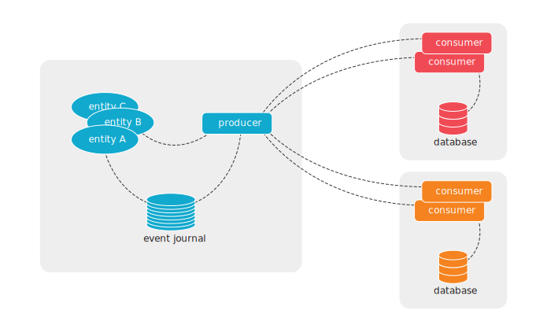
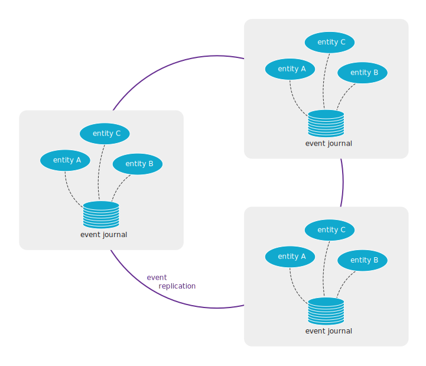

# Feature Summary

Akka Distributed Cluster has two main features:

1. Projections over gRPC - asynchronous brokerless service-to-service communication
1. Replicated Event Sourcing over gRPC - active-active entities

## Projections over gRPC

You would use Projections over gRPC to implement asynchronous brokerless communication between Microservices
implemented with Akka.

We often recommend asynchronous communication between Microservices by using a message broker, such as Kafka.
With Projections over gRPC you could have the same advantages of loosely coupled and reliable message delivery
without the burden and cost of operating the broker infrastructure. As a bonus, you would gain low-latency cross
region delivery of messages.

Projections over gRPC uses the event journal on the producer side and Akka Projections event processing and offset
tracking on the consumer side. The transparent data transfer between producers and consumers is implemented with
Akka gRPC.

The consumer starts an event stream by asking the producer to stream events from the consumer's last offset.
Several consumer services can connect to the same producer service, and each consumer can process the events
in its own pace independent of how fast the events are created or how fast other consumers can handle the events.

In the same way as for any Akka Projection, the consumer keeps track of the offset for the last event it has
processed so that it can continue from the last offset in case of errors or restarts. Offsets are also used for
event de-duplication to achieve exactly-once processing.

The producer and consumer services are typically different Microservices, i.e. different
[Bounded Context](https://martinfowler.com/bliki/BoundedContext.html) in Domain-Driven Design (DDD) terminology, but
it can also be used within one logical Microservice deployed to different locations.

Filters can be used when a consumer is only interested in a subset of the entities. The filters can be defined
on both the producer side and on the consumer side, and they can be changed at runtime.

@@@ note
Events are stored in a database on the producer side. There is no direct database access between consumer and
producer. The offsets on the consumer side are stored in a database, but that is a different database from the
database of the producer.
@@@

### Learn more

* @ref[Part 2 of the Guide: Service to Service eventing](guide/2-service-to-service.md)
* @extref[Reference documentation of Akka Projection gRPC](akka-projection:grpc.html)

## Replicated Event Sourcing over gRPC

You would use Replicated Event Sourcing over gRPC for entities that can be updated in more than one geographical
location, such as different cloud regions. This makes it possible to implement patterns such as active-active and
hot standby.

Replicated Event Sourcing gives:

* redundancy to tolerate failures in one location and still be operational
* serve requests from a location near the user to provide better responsiveness
* balance the load over many servers

The replicas of the entities are running in separate Akka Clusters for the reasons described in
@ref[One Akka Cluster or many connected clusters?](overview.md#one-akka-cluster-or-many-connected-clusters-) and
a reliable event replication transport over gRPC is used between the Akka Clusters. The replica entities belong
to the same logical Microservice, i.e. same [Bounded Context](https://martinfowler.com/bliki/BoundedContext.html)
in Domain-Driven Design (DDD) terminology.

Filters can be used to define that a subset of the entities should be replicated to certain locations.
The filters can be changed at runtime.

@@@ note
Events are stored in a database for each replica. There is no direct database access between a replica and 
the database of another replica, which means different databases, and even different database products, can
be used for the replicas.
@@@

### Learn more

* @ref[Part 3 of the Guide: Active-active](guide/3-active-active.md)
* @extref[Reference documentation of Akka Replicated Event Sourcing](akka:typed/replicated-eventsourcing.html)
* @extref[Reference documentation of Akka Replicated Event Sourcing over gRPC](akka-projection:grpc-replicated-event-sourcing-transport.html)

