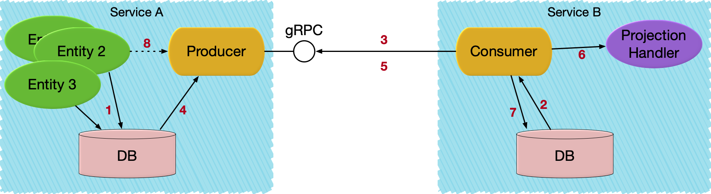

# Part 2: Service to Service eventing

@extref[Akka Projection](akka-projection:/) allows for creating read side views, or projections, that are eventually consistent representations
of the events for an entity. Such views have historically been possible to define in the same service that owns the entity.
For an example of this, see the @extref[popularity projection in the Akka Microservice Guide](akka-guide:microservices-tutorial/projection-query.html).

@extref[Akka Projection gRPC](akka-projection:grpc.html) defines a gRPC service in the service where the entity lives and that makes the events available for
other, separately deployed services, to consume events with an effectively once delivery guarantee, 
this without requiring a message broker in between services. Each of the services has its own lifecycle and is deployed 
separately, possibly in different data centers or cloud regions.

To implement Service to Service eventing, we will use two services, the shopping cart defined in the previous step and 
a downstream analytics service.

## gRPC transport for consuming events



1. An Entity stores events in its journal in service A.
1. Consumer in service B starts an Akka Projection which locally reads its offset for service A's replication stream.
1. Service B establishes a replication stream from service A.
1. Events are read from the journal.
1. Event is emitted to the replication stream.
1. Event is handled.
1. Offset is stored.
1. Producer continues to read new events from the journal and emit to the stream. As an optimization, events can also be published directly from the entity to the producer.


## Publish the events of the shopping cart

The cart itself does not need any changes for publishing persisted events, but we need to configure and bind a producer
service for it to allow other services to consume the events.


Scala
:  @@snip [PublishEvents.scala](/samples/grpc/shopping-cart-service-scala/src/main/scala/shopping/cart/PublishEvents.scala) { #eventProducerService }

Java
:  @@snip [PublishEvents.java](/samples/grpc/shopping-cart-service-java/src/main/java/shopping/cart/PublishEvents.java) { #eventProducerService }

Events can be transformed by application specific code on the producer side. The purpose is to be able to have a
different public representation from the internal representation (stored in journal). The transformation functions
are registered when creating the `EventProducer` service. Here is an example of one of those transformation functions
accessing the projection envelope to include the shopping cart id in the public message type passed to consumers:

Scala
:  @@snip [PublishEvents.scala](/samples/grpc/shopping-cart-service-scala/src/main/scala/shopping/cart/PublishEvents.scala) { #transformItemUpdated }

Java
:  @@snip [PublishEvents.java](/samples/grpc/shopping-cart-service-java/src/main/java/shopping/cart/PublishEvents.java) { #transformItemUpdated }

To omit an event the transformation function can return @scala[`None`]@java[`Optional.empty()`].

That `EventProducer` service is started in an Akka gRPC server like this:

Scala
:  @@snip [ShoppingCartServer.scala](/samples/grpc/shopping-cart-service-scala/src/main/scala/shopping/cart/ShoppingCartServer.scala) { #startServer }

Java
:  @@snip [ShoppingCartServer.java](/samples/grpc/shopping-cart-service-java/src/main/java/shopping/cart/ShoppingCartServer.java) { #startServer }


## Consume events

The consumer is defined in a separate @java[maven]@scala[sbt] project in the shopping analytics service.

The analytics service runs in a separate Akka cluster which is deployed and scaled separately from the shopping cart service.
When running it will have its own separate database from the shopping cart service. It may run in the same region as 
the shopping cart, but it could also run in a completely different location.

On the consumer side the `Projection` is a @extref[SourceProvider for eventsBySlices](akka-projection:eventsourced.html#sourceprovider-for-eventsbyslices)
that is using `eventsBySlices` from the GrpcReadJournal. We use @extref[ShardedDaemonProcess](akka:typed/cluster-sharded-daemon-process.html) to distribute the instances of the Projection across the cluster.

Scala
:  @@snip [ShoppingCartEventConsumer.scala](/samples/grpc/shopping-analytics-service-scala/src/main/scala/shopping/analytics/ShoppingCartEventConsumer.scala) { #initProjections }

Java
:  @@snip [ShoppingCartEventConsumer.java](/samples/grpc/shopping-analytics-service-java/src/main/java/shopping/analytics/ShoppingCartEventConsumer.java) { #initProjections }

The Protobuf descriptors are defined when the GrpcReadJournal is created. The descriptors are used
when deserializing the received events. @scala[The `protobufDescriptors` is a list of the `javaDescriptor` for the used protobuf messages.
It is defined in the ScalaPB generated `Proto` companion object.]
Note that GrpcReadJournal should be created with the GrpcReadJournal @scala[`apply`]@java[`create`] factory method
and not from configuration via `GrpcReadJournalProvider` when using Protobuf serialization.

The gRPC connection to the producer is defined in the @extref[consumer configuration](akka-projection:grpc#consumer-configuration).

The @extref:[R2dbcProjection](akka-persistence-r2dbc:projection.html) has support for storing the offset in a relational database using R2DBC.

The event handler for this sample is just logging the events rather than for example actually building its own read side
in a database for querying:

Scala
:  @@snip [ShoppingCartEventConsumer.scala](/samples/grpc/shopping-analytics-service-scala/src/main/scala/shopping/analytics/ShoppingCartEventConsumer.scala) { #eventHandler }

Java
:  @@snip [ShoppingCartEventConsumer.java](/samples/grpc/shopping-analytics-service-java/src/main/java/shopping/analytics/ShoppingCartEventConsumer.java) { #eventHandler }

The configuration for the `GrpcReadJournal`, for ease of running locally without TLS, may look like this:

@@snip [grpc.conf](/samples/grpc/shopping-analytics-service-java/src/main/resources/grpc.conf) { }

The `client` section in the configuration defines where the producer is running. It is an @extref:[Akka gRPC configuration](akka-grpc:client/configuration.html#by-configuration) with several connection options.

## Filters

Events can be filtered to control what set of events are propagated to the consumers. What is filtered can be managed
in two ways, on the producer side or on the consumer side:

### Producer

The producer may define a filter function on the `EventProducerSource`.

Scala
:  @@snip [PublishEvents.scala](/samples/grpc/shopping-cart-service-scala/src/main/scala/shopping/cart/PublishEvents.scala) { #withProducerFilter }

Java
:  @@snip [PublishEvents.java](/samples/grpc/shopping-cart-service-java/src/main/java/shopping/cart/PublishEvents.java) { #withProducerFilter }

In this example the decision is based on tags, but the filter function can use anything in the
@apidoc[akka.persistence.query.typed.EventEnvelope] parameter or the event itself. Here, the entity sets the tag based
on the total quantity of the shopping cart, which requires the full state of the shopping cart and is not known from
an individual event.

Note that the purpose of the `withProducerFilter` is to toggle if all events for the entity are to be emitted or not.
If the purpose is to filter out certain events you should instead use the `Transformation`.

The producer filter is evaluated before the transformation function, i.e. the event is the original event and not
the transformed event.

### Consumer

The consumer may define declarative filters that are sent to the producer and evaluated on the producer side
before emitting the events.

Consumer filters consists of exclude and include criteria. In short, the exclude criteria are evaluated first and
may be overridden by an include criteria. For more details about the consumer filtering capabilities, see @extref[Akka Projection gRPC](akka-projection:grpc.html#filters)

The filter is updated with the @apidoc[akka.projection.grpc.consumer.ConsumerFilter] extension.

Scala
:  @@snip [ShoppingCartEventConsumer.scala](/samples/grpc/shopping-analytics-service-scala/src/main/scala/shopping/analytics/ShoppingCartEventConsumer.scala) { #update-filter }

Java
:  @@snip [ShoppingCartEventConsumer.java](/samples/grpc/shopping-analytics-service-java/src/main/java/shopping/analytics/ShoppingCartEventConsumer.java) { #update-filter }

Note that the `streamId` must match what is used when initializing the `GrpcReadJournal`, which by default is from
the config property `akka.projection.grpc.consumer.stream-id`.

The filters can be dynamically changed in runtime without restarting the Projections or the `GrpcReadJournal`. The
updates are incremental. For example if you first add an `IncludeTags` of tag `"medium"` and then update the filter
with another `IncludeTags` of tag `"large"`, the full filter consists of both `"medium"` and `"large"`.

To remove a filter criteria you would use the corresponding @apidoc[akka.projection.grpc.consumer.ConsumerFilter.RemoveCriteria], for example
`RemoveIncludeTags`.

The updated filter is kept and remains after restarts of the Projection instances. If the consumer side is
running with Akka Cluster the filter is propagated to other nodes in the cluster automatically with
Akka Distributed Data. You only have to update at one place and it will be applied to all running Projections
with the given `streamId`.

@@@ warning
The filters will be cleared in case of a full Cluster stop, which means that you
need to take care of populating the initial filters at startup.
@@@

See @apidoc[akka.projection.grpc.consumer.ConsumerFilter] for full API documentation.


## Complete Sample Projects

The complete sample can be downloaded from github, the shopping cart:

* Java: https://github.com/akka/akka-projection/tree/main/samples/grpc/shopping-cart-service-java
* Scala: https://github.com/akka/akka-projection/tree/main/samples/grpc/shopping-cart-service-scala

And the consuming analytics service:

* Java: https://github.com/akka/akka-projection/tree/main/samples/grpc/shopping-analytics-service-java
* Scala: https://github.com/akka/akka-projection/tree/main/samples/grpc/shopping-analytics-service-scala

## Running the sample code locally

With a copy of each of the two sample projects for the language of your liking you can run the two services locally on
your own workstation. Docker, a JDK and @java[maven]@scala[sbt] is all that needs to be installed.

### The Shopping Cart

@@@ div { .group-scala }

1. Start a local PostgresSQL server on default port 5432. The `docker-compose.yml` included in the shopping-cart project starts everything required for running locally.

    ```shell
    docker-compose up --wait

    # creates the tables needed for Akka Persistence
    # as well as the offset store table for Akka Projection
    docker exec -i postgres_db psql -U postgres -t < ddl-scripts/create_tables.sql
    ```

2. Start a first node:

    ```shell
    sbt -Dconfig.resource=local1.conf run
    ```

3. (Optional) Start another node with different ports:

    ```shell
    sbt -Dconfig.resource=local2.conf run
    ```

4. (Optional) More can be started:

    ```shell
    sbt -Dconfig.resource=local3.conf run
    ```

5. Check for service readiness

    ```shell
    curl http://localhost:9101/ready
    ```

6. Try it with [grpcurl](https://github.com/fullstorydev/grpcurl). Add at least a total quantity of 10 to the cart, smaller carts are excluded by the event filter.

    ```shell
    # add item to cart
    grpcurl -d '{"cartId":"cart1", "itemId":"socks", "quantity":3}' -plaintext 127.0.0.1:8101 shoppingcart.ShoppingCartService.AddItem
    
    # get cart
    grpcurl -d '{"cartId":"cart1"}' -plaintext 127.0.0.1:8101 shoppingcart.ShoppingCartService.GetCart
    
    # update quantity of item
    grpcurl -d '{"cartId":"cart1", "itemId":"socks", "quantity":5}' -plaintext 127.0.0.1:8101 shoppingcart.ShoppingCartService.AddItem
    
    # check out cart
    grpcurl -d '{"cartId":"cart1"}' -plaintext 127.0.0.1:8101 shoppingcart.ShoppingCartService.Checkout
   
    ```

   or same `grpcurl` commands to port 8102 to reach node 2.

@@@

@@@ div { .group-java }

1. Start a local PostgresSQL server on default port 5432. The included `docker-compose.yml` starts everything required for running locally.

    ```shell
    docker-compose up --wait

    # creates the tables needed for Akka Persistence
    # as well as the offset store table for Akka Projection
    docker exec -i postgres_db psql -U postgres -t < ddl-scripts/create_tables.sql
    ```

2. Make sure you have compiled the project

    ```shell
    mvn compile 
    ```

3. Start a first node:

    ```shell
    mvn compile exec:exec -DAPP_CONFIG=local1.conf
    ```

4. (Optional) Start another node with different ports:

    ```shell
    mvn compile exec:exec -DAPP_CONFIG=local2.conf
    ```

5. (Optional) More can be started:

    ```shell
    mvn compile exec:exec -DAPP_CONFIG=local3.conf
    ```

6. Check for service readiness

    ```shell
    curl http://localhost:9101/ready
    ```

7. Try it with [grpcurl](https://github.com/fullstorydev/grpcurl):

    ```shell
    # add item to cart
    grpcurl -d '{"cartId":"cart1", "itemId":"socks", "quantity":3}' -plaintext 127.0.0.1:8101 shoppingcart.ShoppingCartService.AddItem
    
    # get cart
    grpcurl -d '{"cartId":"cart1"}' -plaintext 127.0.0.1:8101 shoppingcart.ShoppingCartService.GetCart
    
    # update quantity of item
    grpcurl -d '{"cartId":"cart1", "itemId":"socks", "quantity":5}' -plaintext 127.0.0.1:8101 shoppingcart.ShoppingCartService.AddItem
    
    # check out cart
    grpcurl -d '{"cartId":"cart1"}' -plaintext 127.0.0.1:8101 shoppingcart.ShoppingCartService.Checkout
    ```

   or same `grpcurl` commands to port 8102 to reach node 2.

@@@

### The analytics service

@@@ div { .group-scala }


1. Start a local PostgresSQL server on default port 5432. The included `docker-compose.yml` starts everything required for running locally. Note that for convenience this service and the shopping cart service is sharing the same database, in an actual service consuming events the consuming services are expected to have their own separate databases.

    ```shell
    docker-compose up --wait

    # creates the tables needed for Akka Persistence
    # as well as the offset store table for Akka Projection
    docker exec -i postgres_db psql -U postgres -t < ddl-scripts/create_tables.sql
    ```

2. Start a first node:

    ```shell 
    sbt -Dconfig.resource=local1.conf run
    ```

3. Start `shopping-cart-service` and add item to cart

4. Add at least a total quantity of 10 to the cart, smaller carts are excluded by the event filter.

5. Notice the log output in the terminal of the `shopping-analytics-service`

@@@

@@@ div { .group-java }

1. Start a local PostgresSQL server on default port 5432. The included `docker-compose.yml` starts everything required for running locally. Note that for convenience this service and the shopping cart service is sharing the same database, in an actual service consuming events the consuming services are expected to have their own separate databases.

    ```shell
    docker-compose up --wait

    # creates the tables needed for Akka Persistence
    # as well as the offset store table for Akka Projection
    docker exec -i postgres_db psql -U postgres -t < ddl-scripts/create_tables.sql
    ```

2. Start a first node:

    ```shell
    mvn compile exec:exec -DAPP_CONFIG=local1.conf
    ```

3. Start `shopping-cart-service` and add item to cart

4. Notice the log output in the terminal of the `shopping-analytics-service`

@@@

## What's next?

* Turning the shopping cart highly available through Active-Active
