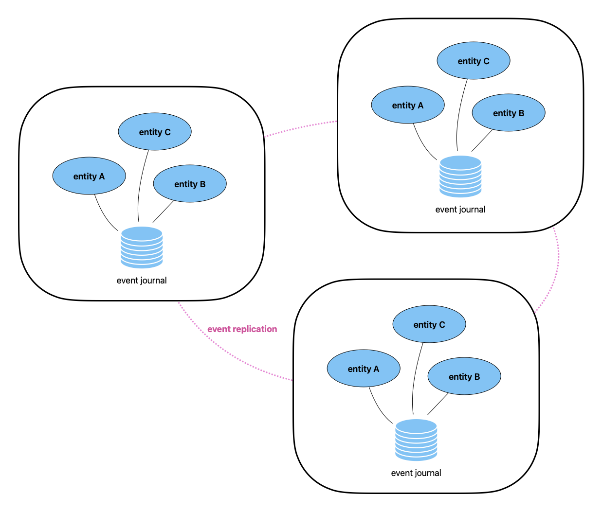

# Part 3: Active-active

Active-active means that the same shopping cart is in memory in multiple locations, replicas, and can accept updates
in all of those locations, so that a cloud region outage does not block users from continuing to use the service.  



@extref[Akka Replicated Event Sourcing](akka:typed/replicated-eventsourcing.html) stores persisted events in a local database,
without any need for replication capabilities in the database itself, the events are then replicated using the @extref[Akka Replicated Event Sourcing gRPC transport](akka-projection:grpc-replicated-event-sourcing-transport.html).

The shopping cart will be eventually consistent, meaning that an update to the cart in one replica will not immediately
be visible in the other replicas, but eventually all replicas will reach the same state. 

## Turning the shopping cart into a Replicated Entity

The API for writing a Replicated Event Sourced entity is mostly the exact same as the Event Sourced Behavior we already
implemented our entity with. 

The events from other replicas will be replicated and are passed to the event handler of the entity
just like events that was written by the shopping cart instance itself, however there is no global ordering of the events, 
so events may be seen in a different order than the wall clock order they happened, and in a different order in each replica, 
especially in circumstances where there are outages or connectivity problems between the replicas.

### Updating the cart contents

Because of the possibility of observing the events out of order when they have been written to different replicas, we must
make sure the state ends up the same even in the face of re-ordered events. 

This can be handled by keeping track of the quantity of an item both when it is positive and negative, so that seeing
a remove of 1 item before an add 1 of the same item ends up as the item removed with a zero quantity. We have already
represented add and remove as a negative or positive number in the `ItemUpdatedEvent`

Scala
:  @@snip [ShoppingCart.scala](/samples/replicated/shopping-cart-service-scala/src/main/scala/shopping/cart/ShoppingCart.scala) { #itemUpdatedEvent }

Java
:  @@snip [ShoppingCart.java](/samples/replicated/shopping-cart-service-java/src/main/java/shopping/cart/ShoppingCart.java) { #itemUpdatedEvent }

In the state, we keep a map from `itemId` to the current quantity for each product. For each update we see, we add the positive or negative
number to the quantity, getting the same number regardless of what order the changes arrived:

Scala
:  @@snip [ShoppingCart.scala](/samples/replicated/shopping-cart-service-scala/src/main/scala/shopping/cart/ShoppingCart.scala) { #stateUpdateItem }

Java
:  @@snip [ShoppingCart.java](/samples/replicated/shopping-cart-service-java/src/main/java/shopping/cart/ShoppingCart.java) { #stateUpdateItem }


### Checking the cart out

Another, more complex thing to deal with is checking out. When we had only one instance of the cart, it was safe to say that
after a checkout event, no more updates could happen to the shopping cart. With a replicated cart this is no longer the case
as an update could be sent to one replica, and the checkout to another, so that the update arrives to the checked out replica
after it was checked out, even though at the time of the update, the cart was not yet checked out.

We can solve this by turning checkout into a two-step process, where the initial checkout triggers storing a checkout event
per replica, and letting one of the replicas get a designation as leader, completing the checkout once it has seen checkout
events from all replicas.

When we receive a checkout command, we store a `Closed` event which also contains the id of the replica. We can get the "self" replica id
from the @apidoc[akka.persistence.typed.*.ReplicationContext]:

Scala
:  @@snip [ShoppingCart.scala](/samples/replicated/shopping-cart-service-scala/src/main/scala/shopping/cart/ShoppingCart.scala) { #checkoutStep1 }

Java
:  @@snip [ShoppingCart.java](/samples/replicated/shopping-cart-service-java/src/main/java/shopping/cart/ShoppingCart.java) { #checkoutStep1 }


In the state we keep a set of all replicas where the cart was closed:

Scala
:  @@snip [ShoppingCart.scala](/samples/replicated/shopping-cart-service-scala/src/main/scala/shopping/cart/ShoppingCart.scala) { #checkoutStep1Event }

Java
:  @@snip [ShoppingCart.java](/samples/replicated/shopping-cart-service-java/src/main/java/shopping/cart/ShoppingCart.java) { #checkoutStep1Event }


After applying the event to the state, we check if one of the other replicas was closed, and in that case we trigger a command to
the shopping cart itself to close also in this replica using the `CloseForCheckout` command. 

If all replicas are closed and this is the designated leader we trigger a `CompleteCheckout` command. Note that this logic
is only triggered if the entity got the event replicated, and not if it is "recovering" - starting after it was stopped and 
is replaying all events stored in the journal: 

Scala
:  @@snip [ShoppingCart.scala](/samples/replicated/shopping-cart-service-scala/src/main/scala/shopping/cart/ShoppingCart.scala) { #checkoutEventTrigger }

Java
:  @@snip [ShoppingCart.java](/samples/replicated/shopping-cart-service-java/src/main/java/shopping/cart/ShoppingCart.java) { #checkoutEventTrigger }

The logic for leader makes sure to not tie all carts to the same replica as leader, but instead spreading it across the replicas, by basing it of a hash of the id of the cart.
This again uses the @apidoc[akka.persistence.typed.*.ReplicationContext] to access the list of all replicas:

Scala
:  @@snip [ShoppingCart.scala](/samples/replicated/shopping-cart-service-scala/src/main/scala/shopping/cart/ShoppingCart.scala) { #leader }

Java
:  @@snip [ShoppingCart.java](/samples/replicated/shopping-cart-service-java/src/main/java/shopping/cart/ShoppingCart.java) { #leader }


Note that this still means that while adding and removing can be done in the face of an outage, all replicas must be online 
for any shopping cart to be able to close, so it does not give us complete high-availability for the shopping cart, 
but it illustrates how we can coordinate when needed.


## Filters

By default, events from all Replicated Event Sourced entities are replicated.

The same kind of filters as described for @ref:[Service to Service](2-service-to-service.md#filters) can be used for
Replicated Event Sourcing. Replicated Event Sourcing is bidirectional replication, and therefore you would typically 
have to define the same filters on both sides. That is not handled automatically. 

One way to make sure filtering is reflective is using a property of the state to tag events, an event applied to the 
state triggering the tag will be replicated to other nodes and lead to the same property change there, eventually 
causing the same filter on all replicas.

To add such filtering to the shopping cart we have added a `vipCustomer` flag on the state, which when true
will lead to adding the tag `vip` to any event emitted for the cart:

Scala
:  @@snip [ShoppingCart.scala](/samples/replicated/shopping-cart-service-scala/src/main/scala/shopping/cart/ShoppingCart.scala) { #stateVipCustomer }

Java
:  @@snip [ShoppingCart.java](/samples/replicated/shopping-cart-service-java/src/main/java/shopping/cart/ShoppingCart.java) { #stateVipCustomer }


An alternative initialization method adds a filter looking for the `vip` tag: 

Scala
:  @@snip [ShoppingCart.scala](/samples/replicated/shopping-cart-service-scala/src/main/scala/shopping/cart/ShoppingCart.scala) { #init-producerFilter }

Java
:  @@snip [ShoppingCart.java](/samples/replicated/shopping-cart-service-java/src/main/java/shopping/cart/ShoppingCart.java) { #init-producerFilter }

For carts not replicated the replica commit round triggered by check out would never complete, as the other 
replicas can not see events from the non-replicated carts. 

An additional check immediately completes checkout for such carts:

Scala
:  @@snip [ShoppingCart.scala](/samples/replicated/shopping-cart-service-scala/src/main/scala/shopping/cart/ShoppingCart.scala) { #checkoutEventTrigger }

Java
:  @@snip [ShoppingCart.java](/samples/replicated/shopping-cart-service-java/src/main/java/shopping/cart/ShoppingCart.java) { #checkoutEventTrigger }


## Running the sample code locally

@@@ div { .group-scala }

1. Start two local PostgresSQL servers, on ports 5101 and 5201. The included `docker-compose.yml` starts everything required for running locally.

    ```shell
    docker-compose up -d

    # creates the tables needed for Akka Persistence
    # as well as the offset store table for Akka Projection
    docker exec -i postgres_db_1 psql -U postgres -t < ddl-scripts/create_tables.sql
    docker exec -i postgres_db_2 psql -U postgres -t < ddl-scripts/create_tables.sql
    ```

2. Start a first node for each replica:

    ```shell
    sbt -Dconfig.resource=replica1-local1.conf run
    ```

    ```shell
    sbt -Dconfig.resource=replica2-local1.conf run
    ```

3. (Optional) Start another node with different ports:

    ```shell
    sbt -Dconfig.resource=replica1-local2.conf run
    ```

    ```shell
    sbt -Dconfig.resource=replica2-local2.conf run
    ```

4. (Optional) More can be started:

    ```shell
    sbt -Dconfig.resource=replica1-local3.conf run
    ```

    ```shell
    sbt -Dconfig.resource=replica2-local3.conf run
    ```

5. Check for service readiness

    ```shell
    curl http://localhost:9101/ready
    ```

    ```shell
    curl http://localhost:9201/ready
    ```

6. Try it with [grpcurl](https://github.com/fullstorydev/grpcurl):

    ```shell
    # add item to cart on the first replica
    grpcurl -d '{"cartId":"cart1", "itemId":"socks", "quantity":7}' -plaintext 127.0.0.1:8101 shoppingcart.ShoppingCartService.AddItem
    
    # get cart from first replica
    grpcurl -d '{"cartId":"cart1"}' -plaintext 127.0.0.1:8101 shoppingcart.ShoppingCartService.GetCart
    
    # get cart from second replica
    grpcurl -d '{"cartId":"cart1"}' -plaintext 127.0.0.1:8201 shoppingcart.ShoppingCartService.GetCart

    # update quantity of item on the second replica
    grpcurl -d '{"cartId":"cart1", "itemId":"socks", "quantity":2}' -plaintext 127.0.0.1:8201 shoppingcart.ShoppingCartService.RemoveItem
    
    # check out cart
    grpcurl -d '{"cartId":"cart1"}' -plaintext 127.0.0.1:8101 shoppingcart.ShoppingCartService.Checkout

    or same `grpcurl` commands to port 8102/8202 to reach node 2.
    ```
   
@@@

@@@ div { .group-java }


1. Start two local PostgresSQL servers, on ports 5101 and 5201. The included `docker-compose.yml` starts everything required for running locally.

    ```shell
    docker-compose up -d

    # creates the tables needed for Akka Persistence
    # as well as the offset store table for Akka Projection
    docker exec -i postgres_db_1 psql -U postgres -t < ddl-scripts/create_tables.sql
    docker exec -i postgres_db_2 psql -U postgres -t < ddl-scripts/create_tables.sql
    ```

2. Make sure you have compiled the project

    ```shell
    mvn compile 
    ```

3. Start a first node for each replica:

    ```shell
    mvn compile exec:exec -DAPP_CONFIG=replica1-local1.conf
    ```

    ```shell
    mvn compile exec:exec -DAPP_CONFIG=replica2-local1.conf
    ```

4. (Optional) Start another node with different ports:

    ```shell
    mvn compile exec:exec -DAPP_CONFIG=replica1-local2.conf
    ```

    ```shell
    mvn compile exec:exec -DAPP_CONFIG=replica2-local2.conf
    ```

5. (Optional) More can be started:

    ```shell
    mvn compile exec:exec -DAPP_CONFIG=replica1-local3.conf
    ```

    ```shell
    mvn compile exec:exec -DAPP_CONFIG=replica2-local3.conf
    ```

6. Check for service readiness

    ```shell
    curl http://localhost:9101/ready
    ```

    ```shell
    curl http://localhost:9201/ready
    ```

7. Try it with [grpcurl](https://github.com/fullstorydev/grpcurl):

    ```shell
    # add item to cart on the first replica
    grpcurl -d '{"cartId":"cart1", "itemId":"socks", "quantity":7}' -plaintext 127.0.0.1:8101 shoppingcart.ShoppingCartService.AddItem

    # get cart from first replica
    grpcurl -d '{"cartId":"cart1"}' -plaintext 127.0.0.1:8101 shoppingcart.ShoppingCartService.GetCart

    # get cart from second replica
    grpcurl -d '{"cartId":"cart1"}' -plaintext 127.0.0.1:8201 shoppingcart.ShoppingCartService.GetCart

    # update quantity of item on the second replica
    grpcurl -d '{"cartId":"cart1", "itemId":"socks", "quantity":2}' -plaintext 127.0.0.1:8201 shoppingcart.ShoppingCartService.RemoveItem

    # check out cart
    grpcurl -d '{"cartId":"cart1"}' -plaintext 127.0.0.1:8101 shoppingcart.ShoppingCartService.Checkout
    ```

   or same `grpcurl` commands to port 8102/8202 to reach node 2.

@@@

## What's next?

* Configuring and deploying the service with Kubernetes