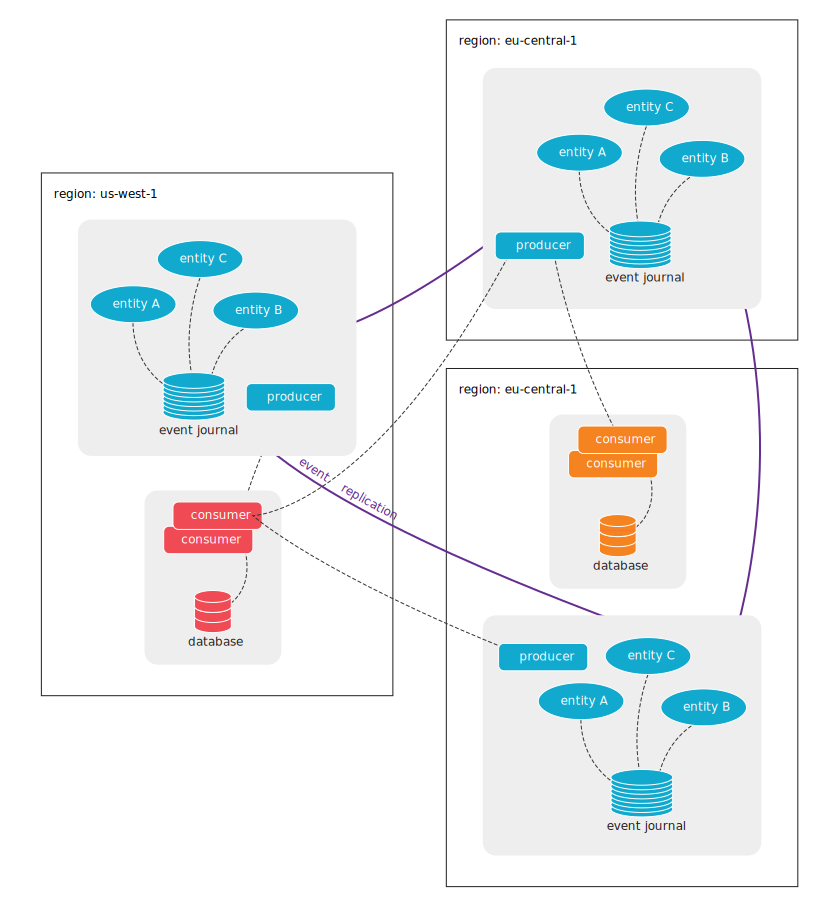

# Akka Distributed Cluster

Akka Distributed Cluster is a set of features in Akka that will help you with:

* stretching an Akka Cluster over geographically distributed locations for higher availability and lower latency
* brokerless asynchronous communication between different Akka Microservices

.

@@toc { depth=2 }

@@@ index

* [Overview](overview.md)
* [Example Use Cases](use-cases.md)
* [Feature Summary](feature-summary.md)
* [Guide](guide.md)

@@@
