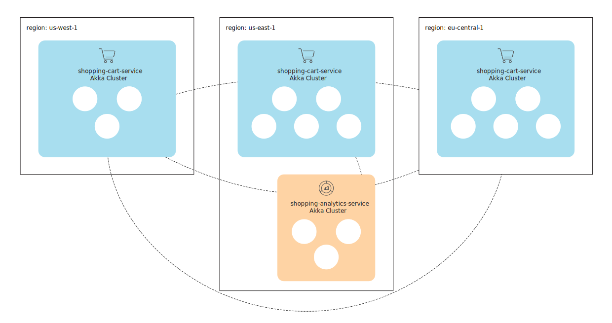

# Architectural Overview

Akka Cluster is great for building stateful distributed systems, such as Microservices. Akka Distributed Cluster 
is a set of features in Akka that will help you with:

* stretching an Akka Cluster over geographically distributed locations for higher availability and lower latency
* brokerless asynchronous communication between different Akka Microservices 

## One Akka Cluster or many connected clusters?

When stretching an Akka Cluster over geographically distributed locations it can be difficult or impossible to
make it work as one single Akka Cluster. Those locations are typically also different Kubernetes clusters. There can be
many problems that must be overcome:

* security considerations of opening up for the peer-to-peer communication between nodes that is required for Akka Cluster
* address translation and connectivity of separate Kubernetes clusters
* reliable Akka Cluster bootstrap mechanism across different Kubernetes clusters
* failure detection and stability of an Akka Cluster with mixed low and high latency

Instead, each geographical location can be a separate, fully autonomous, Akka Cluster and be connected to the other
Akka Clusters with the communication mechanisms provided by Akka Distributed Cluster.

The communication transport between the Akka Clusters is then using reliable event replication over gRPC, which
gives characteristics such as:

* security with TLS and mutual authentication (mTLS)
* network friendly across different Kubernetes clusters using ordinary ingress and load balancers
* exactly-once processing or at-least-once processing
* asynchronous and brokerless communication without need of additional products

For Microservices there are additional reasons for keeping the services isolated in separate Akka Clusters as
described in @extref[Choosing Akka Cluster - Microservices](akka:typed/choosing-cluster.html).

## Event Replication

Event replication is at the core of Akka Distributed Cluster. The event journal of the Event Sourced Entities
is the source of truth and also used as source for publishing events to other services or replicas. By streaming
the events from the journal directly to consumers with full backpressure based on demand from the consumer we
have a solution for asynchronous communication without requiring an intermediate message broker product.

The sequence numbers of the events and the offset tracking by the consumers via Akka Projections gives
at-least once reliable delivery with automatic de-duplication for exactly-once processing.

Entities are assigned to a "slice" for data partitioning. For parallel processing different consumers can take
different ranges of the slices. This consumer slice distribution can be scaled at runtime to be able to
adapt to changes in load.

Events are read from the journal when a consumer sets up a new subscription, but when the consumer is up-to-date
with the latest events it can consume the "live" events immediately without the latency from the database
round trip. This gives very low end-to-end latency. The journal is still used as the reliable source in
case the consumer can't keep up or in failure scenarios.

@@@ note
Currently, the event replication mechanism requires Event Sourced entities as the source on the producer side.
Replication of Akka's Durable State entities is currently not supported. 
@@@

## Dynamic filters

Events from all entities might not be needed at all locations. Therefore, it is possible to define filters that
select which entities to replicate where. These filters are typically defined by tagging the events, but can
also select individual entity identifiers.

The filters can be defined on both the producer side and on the consumer side, and they can be changed at runtime.
The ability to dynamically change the filters without tearing down the event stream opens up for building
very flexible and efficient interactions between services or geographically distributed systems.

When a filter includes events from an entity that the consumer has not seen before, this is automatically detected
and the preceding events are replayed and delivered to the consumer so that it can process all events in the right
order.
