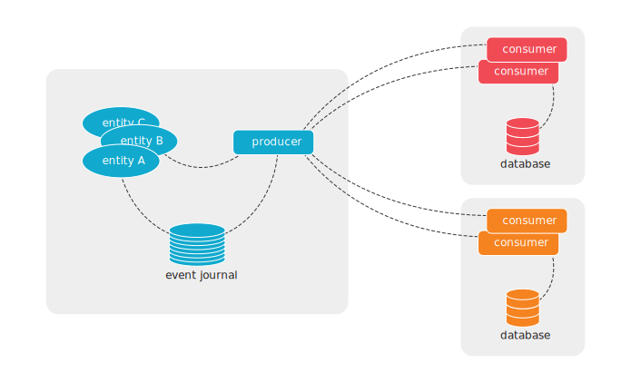

# Feature Summary

The main feature of Akka Edge is Projections over gRPC - asynchronous brokerless service-to-service communication.

## Projections over gRPC

You would use Projections over gRPC to implement asynchronous brokerless communication between services
implemented with Akka.

We often recommend asynchronous communication between Microservices by using a message broker, such as Kafka.
With Projections over gRPC you could have the same advantages of loosely coupled and reliable message delivery
without the burden and cost of operating the broker infrastructure. As a bonus, you would gain low-latency
delivery of messages.

FIXME adjust diagram

Projections over gRPC uses the event journal on the producer side and Akka Projections event processing and offset
tracking on the consumer side. The transparent data transfer between producers and consumers is implemented with
Akka gRPC.

The consumer starts an event stream by asking the producer to stream events from the consumer's last offset.
Several consumer services can connect to the same producer service, and each consumer can process the events
in its own pace independent of how fast the events are created or how fast other consumers can handle the events.

In the same way as for any Akka Projection, the consumer keeps track of the offset for the last event it has
processed so that it can continue from the last offset in case of errors or restarts. Offsets are also used for
event de-duplication to achieve exactly-once processing.

Filters can be used when a consumer is only interested in a subset of the entities. The filters can be defined
on both the producer side and on the consumer side, and they can be changed at runtime.

@@@ note
Events are stored in a database on the producer side. There is no direct database access between consumer and
producer. The offsets on the consumer side are stored in a database, but that is a different database from the
database of the producer.
@@@

### Edge is consumer

This case describes when the edge service is the consumer of events.

The edge consumer service connects to the producer service to initiate the event stream flowing from the producer.

The offsets on the consumer side are stored in a database, but if the environment for the edge service doesn't
have the capabilities to run a full database it can be a single Akka node with embedded @extref[H2 database](akka-persistence-r2dbc:getting-started.html#using-h2).
The file mode of H2 is recommended to reduce memory requirements. That means that if the edge service is restarted
with a different file system all previous events will be delivered to the consumer again.

@@@ Warning
H2 database should not be used when the service is an Akka Cluster with more than 1 node.
@@@

To reduce the amount of events sent over the network you can use @extref[snapshots as starting points](akka-projection:grpc.html#starting-from-snapshots).
You can also @extref[start from custom offset](akka-projection:grpc.html#start-from-custom-offset), e.g. an offset
a few hours back in time.

When you have many edge consumer services connected to the same producer service it's recommended to enable the
feature for @extref[many consumers](akka-projection:grpc.html#many-consumers). The purpose of that feature is to
share the stream of events from the database and fan out to connected consumer streams.

### Edge is producer

This cases describe when the edge service is the producer of events.

The edge producer service connects to the consumer service to initiate the event stream flowing from the producer.
For this you need to setup @extref[Akka Projection gRPC with producer push](akka-projection:grpc-producer-push.html).

Events are stored in a database on the producer side, but if the environment for the edge service doesn't
have the capabilities to run a full database it can be a single Akka node with embedded @extref[H2 database](akka-persistence-r2dbc:getting-started.html#using-h2).
The file mode of H2 is recommended to reduce memory requirements. That means that if the edge service is restarted
with a different file system all stored events are lost. For some edge services that may be totally fine, for others
it may not be an option.

@@@ Warning
H2 database should not be used when the service is an Akka Cluster with more than 1 node.
@@@

Learn more:

* FIXME link to guide
* @extref[Reference documentation of Akka Projection gRPC](akka-projection:grpc.html)

