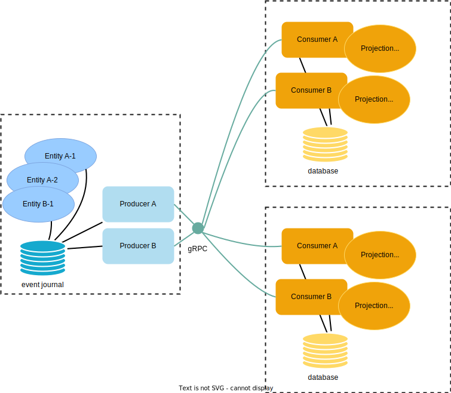
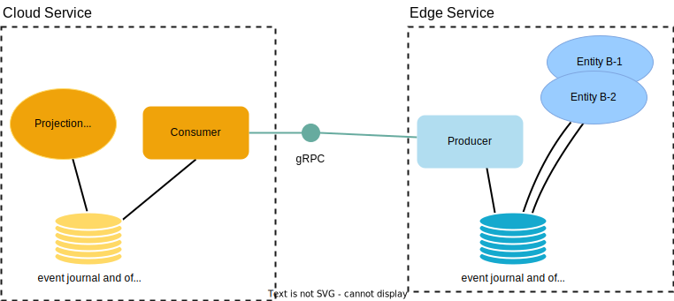
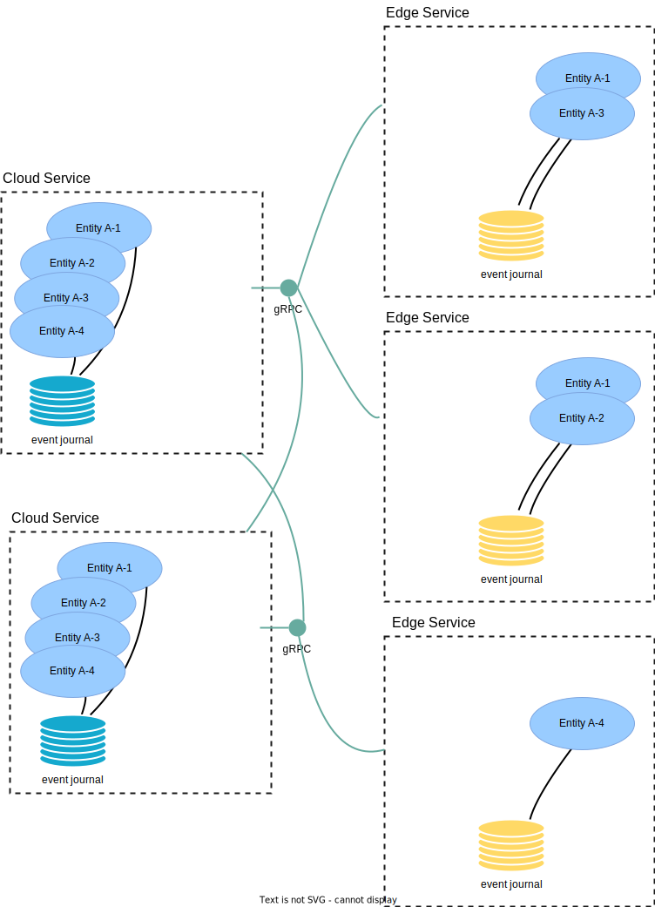

# Feature Summary

Akka Edge has two main features:

1. Projections over gRPC - asynchronous brokerless service-to-service communication
1. Replicated Event Sourcing over gRPC - active-active entities

## Projections over gRPC

You would use Projections over gRPC to implement asynchronous brokerless communication between services
implemented with Akka.

We often recommend asynchronous communication between Microservices by using a message broker, such as Kafka.
With Projections over gRPC you could have the same advantages of loosely coupled and reliable message delivery
without the burden and cost of operating the broker infrastructure. As a bonus, you would gain low-latency
delivery of messages.

Projections over gRPC uses the event journal on the producer side and Akka Projections event processing and offset
tracking on the consumer side. The transparent data transfer between producers and consumers is implemented with
gRPC.

The consumer starts an event stream by asking the producer to stream events from the consumer's last offset.
Several consumer services can connect to the same producer service, and each consumer can process the events
in its own pace independent of how fast the events are created or how fast other consumers can handle the events.

In the same way as for any Akka Projection, the consumer keeps track of the offset for the last event it has
processed so that it can continue from the last offset in case of errors or restarts. Offsets are also used for
event de-duplication to achieve exactly-once processing.

Filters can be used when a consumer is only interested in a subset of the entities. The filters can be defined
on both the producer side and on the consumer side, and they can be changed at runtime.

@@@ note
Events are stored on the producer side. There is no direct storage access between a consumer and
producer. The offsets on the consumer side are also stored, but that is a different form of storage to that of the
producer.
@@@

### Edge is consumer

This case describes when the edge service is the consumer of events.

* The edge consumer service connects to the producer service to initiate the event stream flowing from the producer.
* The edge consumer starts from the offset that it has stored, or from the beginning if no offset is stored.
* Events are read from the journal on the producer side and emitted to the replication stream.
* Events are handled on the consumer side and corresponding offset is stored.
* New events are emitted from the producer.
* The stream remains open until either side chooses to close it, or there is an error.

The offsets on the consumer side are stored, but if the environment for the edge service does not
have the capabilities to run a full database it can be a single Akka node with an embeddable storage such as the @extref[H2 database](akka-persistence-r2dbc:getting-started.html#using-h2).

Note that when using H2, the file mode is recommended to reduce memory requirements. That means that if the edge service is restarted
with a different file system all previous events will be delivered to the consumer again.

@@@ Warning
H2 database should not be used when the service is an Akka Cluster with more than 1 node.
@@@

To reduce the amount of events sent over the network you can use @extref[snapshots as starting points](akka-projection:grpc.html#starting-from-snapshots).
You can also @extref[start from custom offset](akka-projection:grpc.html#start-from-custom-offset), e.g. an offset
a few hours back in time.

When you have many edge consumer services connected to the same producer service it's recommended to enable the
feature for @extref[many consumers](akka-projection:grpc.html#many-consumers). The purpose of that feature is to
share the stream of events from storage and fan out to connected consumer streams.

### Edge is producer

This case describes when the edge service is the producer of events.

* The edge producer service connects to the consumer service to initiate the event stream flowing from the producer.
* The edge producer starts from the offset that it has stored, or from the beginning if no offset is stored.
* Events are read from the journal on the producer side and emitted to the replication stream.
* The consumer writes incoming events directly to its journal, and acknowledge back to the producer.
* When acknowledged, the corresponding offset is stored on the producer side.
* New events are emitted from the producer.
* The stream remains open until either side chooses to close it, or there is an error.
* On the consumer side, separate projections can run over the local journal with events from all producers.

There are actually two projections here. One projection for the event replication from producer to consumer,
without application specific processing of the events other than transformation and filtering. Then a second, ordinary,
projection on the consumer side to process the events.

Note that the connection is established from the edge service. For this you need to setup @extref[Akka Projection gRPC with producer push](akka-projection:grpc-producer-push.html).

@@@ note
If you can establish the connection in the other direction, from the cloud consumer to the edge producer, you may
instead use an ordinary @extref[Akka Projection over gRPC](akka-projection:grpc.html) without the producer push mechanism.
That is often difficult for the edge, but with a VPN solution it could be possible. Another challenge is
that the cloud service would need to know about all edge services.
@@@

Events are stored on the producer side, but if the environment for the edge service does not
have the capabilities to run a full database it can be a single Akka node with embeddable storage such as the @extref[H2 database](akka-persistence-r2dbc:getting-started.html#using-h2).

Note that the file mode of H2 is recommended to reduce memory requirements. That means that if the edge service is restarted
with a different file system all stored events are lost. For some edge services that may be totally fine, for others
it may not be an option.

@@@ Warning
H2 database should not be used when the service is an Akka Cluster with more than 1 node.
@@@

### Durable State as source of events

Projections over gRPC requires events, and are therefore typically used with `EventSourcedBehavior`.
`DurableStateBehavior` can also be the source of events and be used with Projections over gRPC.
For `DurableStateBehavior` you need to use change events as described in @extref[Changes from Durable State](akka-projection:durable-state.html#sourceprovider-for-eventsbyslices).

### Learn more

* @ref[Hands-on guide for implementing an Akka Edge application](guide.md)
* @extref[Reference documentation of Akka Projection gRPC](akka-projection:grpc.html)
* @extref[Reference documentation of Akka Projection gRPC with producer push](akka-projection:grpc-producer-push.html)

## Replicated Event Sourcing over gRPC

You would use Replicated Event Sourcing over gRPC for entities that can be updated in more than one geographical
location, such as edge Point-of-Presence (PoP) and different cloud regions. This makes it possible to implement
patterns such as active-active and hot standby.

Replicated Event Sourcing gives:

* redundancy to tolerate failures in one location and still be operational
* serve requests from a location near the user to provide better responsiveness
* allow updates to an entity from several locations
* balance the load over many servers

The replicas of the entities are running in separate Akka Clusters in the cloud and edge.
A reliable event replication transport over gRPC is used between the Akka Clusters. The replica entities belong
to the same logical Microservice, i.e. same [Bounded Context](https://martinfowler.com/bliki/BoundedContext.html)
in Domain-Driven Design (DDD) terminology.

Note that the connection is established from the edge service. For this you need to setup @extref[Akka Replicated Event Sourcing gRPC with edge topology](akka-projection:grpc-replicated-event-sourcing-transport.html#edge-topology).

Filters can be used to define that a subset of the entities should be replicated to certain locations.
The filters can be changed at runtime.

@@@ note
Events are stored in a database for each replica. There is no direct database access between a replica and
the database of another replica, which means different databases, and even different database products, can
be used for the replicas. For example, Postgres in the Cloud and H2 at the edge.
@@@

### Learn more

* FIXME link to guide
* @extref[Reference documentation of Akka Replicated Event Sourcing](akka:typed/replicated-eventsourcing.html)
* @extref[Reference documentation of Akka Replicated Event Sourcing over gRPC](akka-projection:grpc-replicated-event-sourcing-transport.html)
