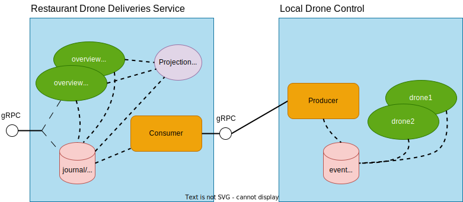

# Coarse Grained Location Replication

In the previous step of the guide we implemented the PoP local control service keeping track of drone locations.

We also want to publish coarse grained location updates at a low frequency from the edge to a central cloud service. 



In this step we will cover publishing and consuming those events, passing them to a stateful overview-version of the 
drone digital twin. We will use @extref[Akka Projection gRPC](akka-projection:grpc.html) to do service-to-service events passing with an
effectively once delivery guarantee, this without requiring a message broker in between services. The cloud and the many
PoP services each has their own lifecycle and are deployed separately in different places.

We will then implement a gRPC service for querying the coarse grained location of the global set of drones in the cloud service.

## Coarse grained location aggregation and publishing

We have already seen the additional `CoarseGrainedLocationChanged` event persisted in the previous step of the guide. 
Now we will update the local-drone-control service to also publish these aggregate events upstream to a cloud service 
so that it can keep a rough overview of where all drones are without needing to handle the global load of detailed and 
frequent updates from all drones.

Normally for Akka gRPC projections the consumer initiates the connection, but in edge scenarios it might be problematic
because of firewalls not allowing the cloud to connect to each PoP. The normal consumer initiated connections also means
that all producers must be known up front by the consumer.

To solve this the local control center push events to the cloud using @extref[Akka gRPC projection with producer push](akka-projection:grpc-producer-push.html)
which means the control center will initiate the connection.

The actual pushing of events is implemented as a single actor behavior, if partitioning is needed for scaling that is also possible
by letting multiple actors handle partitions of the entire stream of events from local drones.

Scala
:  @@snip [DroneEvents.scala](/samples/grpc/local-drone-control-scala/src/main/scala/local/drones/DroneEvents.scala) { }

Java
:  @@snip [DroneEvents.java](/samples/grpc/local-drone-control-java/src/main/java/local/drones/DroneEvents.java) { }

Two important things to note:

1. A producer filter is applied to only push `CoarseGrainedLocationChanged` and not the fine-grained `PositionUpdated` events.
2. The internal domain representation of `CoarseGrainedLocationChanged` is transformed into an explicit public protocol
   protobuf message `local.drones.proto.CoarseDroneLocation` message, for loose coupling between consumer and producer and
   easier evolution over time without breaking wire compatibility.
3. The service defines a "location name" which is a unique identifier of the PoP in the format `country/city/part-of-city`,
   it is used as `originId` for the producer push stream, identifying where the stream of events come from.

## Producer Push Destination

The producer push destination is a gRPC service where producers push events, the events are persisted in a local journal
as is, or after a transformation to an internal representation. For more details see @extref[Akka gRPC projection with producer push documentation](akka-projection:grpc-producer-push.html).

We'll implement the producer push destination in a new service separate service, intended to run as a clustered deployment in the cloud, where all the 
local control services will push their aggregate events, the "Restaurant Drone Deliveries Service". 

In addition to accepting the events, we pick the local control center location (which is in the format `country/city/part-of-city`) passed as
producer `originId` on producer connection, and put it in a tag for the event.

The setup logic looks like this:

Scala
:  @@snip [DroneEvents.scala](/samples/grpc/restaurant-drone-deliveries-service-scala/src/main/scala/central/drones/LocalDroneEvents.scala) { #eventConsumer }

Java
:  @@snip [DroneEvents.java](/samples/grpc/restaurant-drone-deliveries-service-java/src/main/java/central/drones/LocalDroneEvents.java) { #eventConsumer }

The returned @scala[PartialFunction]@java[Function] is an Akka HTTP gRPC request handler that can be bound directly in an HTTP server or
combined with multiple other request handlers and then bound as a single server: 

Scala
:  @@snip [DroneDeliveriesServer.scala](/samples/grpc/restaurant-drone-deliveries-service-scala/src/main/scala/central/DroneDeliveriesServer.scala) { #composeAndBind }

Java
:  @@snip [DroneDeliveriesServer.java](/samples/grpc/restaurant-drone-deliveries-service-java/src/main/java/central/DroneDeliveriesServer.java) { #composeAndBind }

As persistent storage for the event journal we are using PostgreSQL, we cannot use H2 like the local drone control service, as the 
central cloud service is clustered and needs an external database that can accept connections from multiple separate cluster nodes.

Config to use PostgreSQL looks like this:

Scala
:  @@snip [persistence.conf](/samples/grpc/restaurant-drone-deliveries-service-scala/src/main/resources/persistence.conf) { }

Java
:  @@snip [persistence.conf](/samples/grpc/restaurant-drone-deliveries-service-java/src/main/resources/persistence.conf) { }


## Consuming the pushed events

What we have set up only means that the pushed events are written into our local journal, to do something useful with the 
events we need to run a projection consuming the events. We'll turn them into commands and send them to an entity.

The projection is run as @extref[Akka Sharded Daemon Process](akka:typed/cluster-sharded-daemon-process.html) to partition 
the global stream of events among multiple consumers balanced over the nodes of the restaurant-drone-deliveries-service. 

The handler of the projection turns the protobuf message `CoarseDroneLocation` pushed by the producer and stored in the 
local journal into a `Drone.UpdateLocation` and sends it over Akka Cluster Sharding to the right drone overview entity:

Scala
:  @@snip [DroneEvents.scala](/samples/grpc/restaurant-drone-deliveries-service-scala/src/main/scala/central/drones/LocalDroneEvents.scala) { #eventProjection }

Java
:  @@snip [DroneEvents.java](/samples/grpc/restaurant-drone-deliveries-service-java/src/main/java/central/drones/LocalDroneEvents.java) { #eventProjection }

FIXME this is a lot in one snippet, split it up in multiple parts?

## Durable State Drone Overview

For the cloud representation of the drones, only containing the rough location, we use @extref[Durable State](akka:typed/durable-state/persistence.html), 
which instead of event sourcing is more like a key-value storage, where each actor command can lead to persisting the complete state of the actor.

### Commands

The cloud drone entity supports two commands, much like the PoP drone entity. The commands are `UpdateLocation` and `GetState`:

Scala
:  @@snip [Drone.scala](/samples/grpc/restaurant-drone-deliveries-service-scala/src/main/scala/central/drones/Drone.scala) { #commands }

Java
:  @@snip [Drone.java](/samples/grpc/restaurant-drone-deliveries-service-java/src/main/java/central/drones/Drone.java) { #commands }

### State

The state of the drone contains the location name of the PoP it talked to last, the coarse grained coordinates it last reported if it did and the
timestamp when that happened:

Scala
:  @@snip [Drone.scala](/samples/grpc/restaurant-drone-deliveries-service-scala/src/main/scala/central/drones/Drone.scala) { #state }

Java
:  @@snip [Drone.java](/samples/grpc/restaurant-drone-deliveries-service-java/src/main/java/central/drones/Drone.java) { #state }

The initial state, signifying that the durable state newer saw any update uses a special location "unknown", and
an @scala[`None`]@java[`Optional.empty()`] for its location.


Scala
:  @@snip [Drone.scala](/samples/grpc/restaurant-drone-deliveries-service-scala/src/main/scala/central/drones/Drone.scala) { #emptyState }

Java
:  @@snip [Drone.java](/samples/grpc/restaurant-drone-deliveries-service-java/src/main/java/central/drones/Drone.java) { #emptyState }


### Command handler

The command handler turns `UpdateLocation` commands into an update to its state and persists that and replies with the 
current state for the `GetState` command: 

Scala
:  @@snip [Drone.scala](/samples/grpc/restaurant-drone-deliveries-service-scala/src/main/scala/central/drones/Drone.scala) { #commandHandler }

Java
:  @@snip [Drone.java](/samples/grpc/restaurant-drone-deliveries-service-java/src/main/java/central/drones/Drone.java) { #commandHandler }


## Storing query representation for easier querying

The Akka R2DBC plugin contains a feature for @extref[writing durable state query representation](akka-persistence-r2dbc:durable-state-store.html#storing-query-representation) in the same transaction as the state update. We'll use that to write the `locationName` to 
a queryable column in the PostgreSQL database.

First step is to add a `location` column to the durable state table schema:

Scala
:  @@snip [create_tables.sql](/samples/grpc/restaurant-drone-deliveries-service-scala/ddl-scripts/create_tables.sql) { #queryableColumn }

Java
:  @@snip [create_tables.sql](/samples/grpc/restaurant-drone-deliveries-service-java/ddl-scripts/create_tables.sql) { #queryableColumn }

We then implement @scala[`AdditionalColumn[Drone.State, String]`]@java[`AdditionalColumn<Drone.State, String>`]:

Scala
:  @@snip [LocationColumn.scala](/samples/grpc/restaurant-drone-deliveries-service-scala/src/main/scala/central/drones/Drone.scala) { #locationColumn }

Java
:  @@snip [LocationColumn.java](/samples/grpc/restaurant-drone-deliveries-service-java/src/main/java/central/drones/LocationColumn.java) { }

Finally, we add configuration to make Akka Persistence R2DBC use the `LocationColumn` when writing state:

Scala
:  @@snip [persistence.conf](/samples/grpc/restaurant-drone-deliveries-service-scala/src/main/resources/persistence.conf) { #locationColumn }

Java
:  @@snip [persistence.conf](/samples/grpc/restaurant-drone-deliveries-service-java/src/main/resources/persistence.conf) { #locationColumn }


## gRPC service

To make it possible for users of our service to query the drone overviews we define a gRPC service:

Scala
:  @@snip [drone_overview_api.proto](/samples/grpc/restaurant-drone-deliveries-service-scala/src/main/protobuf/central/drones/drone_overview_api.proto) { }

Java
:  @@snip [drone_overview_api.proto](/samples/grpc/restaurant-drone-deliveries-service-java/src/main/protobuf/central/drones/drone_overview_api.proto) { }

And implement the service interface Akka gRPC generates for it.

The `getDroneOverview` method asks the drone entity directly about its current state. 

The `getCoarseDroneLocations` is a bit more involved, querying using the `locations` column, and then using 
the Akka Serialization infrastructure to deserialize the found drone `State` instances. Grouping the drones
in the same coarse grained location and finally turning that map into a protobuf response message:

Scala
:  @@snip [DroneOverviewServiceImpl.scala](/samples/grpc/restaurant-drone-deliveries-service-scala/src/main/scala/central/drones/DroneOverviewServiceImpl.scala) { }

Java
:  @@snip [DroneOverviewServiceImpl.java](/samples/grpc/restaurant-drone-deliveries-service-java/src/main/java/central/drones/DroneOverviewServiceImpl.java) { }

Finally, we need to start the HTTP server, making service implementation available for calls from drones:

Scala
:  @@snip [LocalDroneControlServer.scala](/samples/grpc/restaurant-drone-deliveries-service-scala/src/main/scala/central/DroneDeliveriesServer.scala) { #composeAndBind }

Java
:  @@snip [LocalDroneControlServer.java](/samples/grpc/restaurant-drone-deliveries-service-java/src/main/java/central/DroneDeliveriesServer.java) { #composeAndBind }

## Running the sample

The complete sample can be downloaded from GitHub, but note that it also includes the next steps of the guide:

* Java: https://github.com/akka/akka-projection/tree/main/samples/grpc/restaurant-drone-deliveries-service-java
* Scala: https://github.com/akka/akka-projection/tree/main/samples/grpc/restaurant-drone-deliveries-service-scala

As this service consumes events from the service built in the previous step, start the local-drone-control service first: 

@@@ div { .group-scala }

To start the local-drone-control-service:

```shell
sbt run
```

@@@

@@@ div { .group-java }

```shell
mvn compile exec:exec
```

@@@

Then start the drone-restaurant-deliveries-service.

As the service needs a PostgreSQL instance running, start that up in a docker container and create the database
schema:

```shell
 docker compose up --wait

 # creates the tables needed for Akka Persistence
 # as well as the offset store table for Akka Projection
 docker exec -i postgres_db psql -U postgres -t < ddl-scripts/create_tables.sql
 ```

Then start the service:

@@@ div { .group-scala }

```shell
sbt -Dconfig.resource=local1.conf run
```

And optionally one or two more Akka cluster nodes, but note that the local drone controls
are statically configured to the gRPC port of the first and will only publish events to that node.

```shell
sbt -Dconfig.resource=local2.conf run
sbt -Dconfig.resource=local3.conf run
```

@@@

@@@ div { .group-java }

```shell
mvn compile exec:exec -DAPP_CONFIG=local1.conf
```

And optionally one or two more Akka cluster nodes, but note that the local drone controls
are statically configured to the gRPC port of the first and will only publish events to that node.

```shell
mvn compile exec:exec -DAPP_CONFIG=local2.conf
mvn compile exec:exec -DAPP_CONFIG=local3.conf
```

@@@


Now update one or more drones a few times with [grpcurl](https://github.com/fullstorydev/grpcurl) against the local-drone-control:

```shell 
grpcurl -d '{"drone_id":"drone1", "coordinates": {"longitude": 18.07125, "latitude": 59.31834}, "altitude": 5}' -plaintext 127.0.0.1:8080 local.drones.DroneService.ReportLocation
 
grpcurl -d '{"drone_id":"drone1", "coordinates": {"longitude": 18.08125, "latitude": 59.41834}, "altitude": 10}' -plaintext 127.0.0.1:8080 local.drones.DroneService.ReportLocation

grpcurl -d '{"drone_id":"drone2", "coordinates": {"longitude": 18.07125, "latitude": 59.41834}, "altitude": 8 }' -plaintext 127.0.0.1:8080 local.drones.DroneService.ReportLocation

grpcurl -d '{"drone_id":"drone2", "coordinates": {"longitude": 18.07125, "latitude": 59.41834}, "altitude": 8 }' -plaintext 127.0.0.1:8080 local.drones.DroneService.ReportLocation

grpcurl -d '{"drone_id":"drone2", "coordinates": {"longitude": 18.08114, "latitude": 59.42122}, "altitude": 8 }' -plaintext 127.0.0.1:8080 local.drones.DroneService.ReportLocation
```

Then query the cloud service:
```shell
grpcurl -d '{"location":"sweden/stockholm/kungsholmen"}' -plaintext localhost:8101 central.drones.DroneOverviewService/GetCoarseDroneLocations
```

If you posted the drone location updates above you should see the two drones listed at the same coarse grained coordinates.

You can also query the individual drones for their specific coarse grained location:

```shell
grpcurl -d '{"drone_id":"drone1"}' -plaintext localhost:8101 central.drones.DroneOverviewService.GetDroneOverview
```

## What's next?

* Accept restaurant delivery orders in the restaurant-drone-deliveries-service 