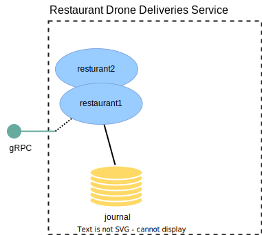

# Restaurant deliveries

In this section we will update the restaurant-drone-deliveries-service to accept and store restaurant delivery orders.



Just like for the drones in the first step of the guide we will represent each restaurant and its list of orders as
an @extref[Event Sourced Entity](akka:typed/persistence.html).

## Implementing the restaurant entity

### Commands and events

The `RestaurantDeliveries` actor represents deliveries for one restaurant. It accepts the commands `SetUpRestaurant` to
initialize a restaurant with its location, and `RegisterDelivery` and `ListCurrentDeliveries` to add and inspect the 
current deliveries of the restaurant:

Scala
:  @@snip [RestaurantDeliveries.scala](/samples/grpc/restaurant-drone-deliveries-service-scala/src/main/scala/central/deliveries/RestaurantDeliveries.scala) { #commands #events }

Java
:  @@snip [RestaurantDeliveries.java](/samples/grpc/restaurant-drone-deliveries-service-java/src/main/java/central/deliveries/RestaurantDeliveries.java) { #commands #events }


### State

The state starts out as @java[`null`]@scala[`None`] and then, once the restaurant has been set up will be @scala[`Some` containing] an instance of `State`, 
which contains the coordinates of the restaurant, the location id of the local-drone-control-service it is closest to, and a list of registered deliveries:

Scala
:  @@snip [RestaurantDeliveries.scala](/samples/grpc/restaurant-drone-deliveries-service-scala/src/main/scala/central/deliveries/RestaurantDeliveries.scala) { #state }

Java
:  @@snip [RestaurantDeliveries.java](/samples/grpc/restaurant-drone-deliveries-service-java/src/main/java/central/deliveries/RestaurantDeliveries.java) { #state }


### Command handler

Since the `RestaurantDeliveries` can be started with no state, it has two different command handlers, one for no state,
where it only accepts the `SetUpRestaurant` command, and one where it accepts the delivery related commands:

Scala
:  @@snip [RestaurantDeliveries.scala](/samples/grpc/restaurant-drone-deliveries-service-scala/src/main/scala/central/deliveries/RestaurantDeliveries.scala) { #commandHandler }

Java
:  @@snip [RestaurantDeliveries.java](/samples/grpc/restaurant-drone-deliveries-service-java/src/main/java/central/deliveries/RestaurantDeliveries.java) { #commandHandler }

### gRPC service

To make it possible for users of our service to administer the available restaurants and their queued orders we define 
a gRPC service with one endpoint for setting up restaurants and one to register a delivery for an already set up restaurant: 

Scala
:  @@snip [drone_overview_api.proto](/samples/grpc/restaurant-drone-deliveries-service-scala/src/main/protobuf/central/deliveries/restaurant_deliveries_api.proto) { }

Java
:  @@snip [drone_overview_api.proto](/samples/grpc/restaurant-drone-deliveries-service-java/src/main/protobuf/central/deliveries/restaurant_deliveries_api.proto) { }

And implement the service interface Akka gRPC generates for it.

The `setUpRestaurant` method first validates that the location id in the request is known, from a pre-defined set of locations in the application config.
Then sends a `SetUpRestaurant` command to the entity to set it up.

Scala
:  @@snip [RestaurantDeliveriesServiceImpl.scala](/samples/grpc/restaurant-drone-deliveries-service-scala/src/main/scala/central/deliveries/RestaurantDeliveriesServiceImpl.scala) { }

Java
:  @@snip [RestaurantDeliveriesServiceImpl.java](/samples/grpc/restaurant-drone-deliveries-service-java/src/main/java/central/deliveries/RestaurantDeliveriesServiceImpl.java) { }


## Running the sample

The complete sample can be downloaded from GitHub, but note that it also includes the next step of the guide:

* Scala [restaurant-drone-deliveries-service.zip](../attachments/restaurant-drone-deliveries-service-scala.zip)
* Java [restaurant-drone-deliveries-service.zip](../attachments/restaurant-drone-deliveries-service-java.zip)

In this step we created a local entity, so we can try it out by running the restaurant-drone-deliveries-service without
any local-drone-control services.

To start the drone-restaurant-deliveries-service.

As the service needs a PostgreSQL instance running, start that up in a docker container and create the database
schema (if you didn't do that in the previous guide step):

```shell
docker compose up --wait
docker exec -i postgres_db psql -U postgres -t < ddl-scripts/create_tables.sql
```

Then start the service:

@@@ div { .group-scala }

```shell
sbt -Dconfig.resource=local1.conf run
```

And optionally one or two more Akka cluster nodes, but note that the local drone controls
are statically configured to the gRPC port of the first and will only publish events to that node.

```shell
sbt -Dconfig.resource=local2.conf run
sbt -Dconfig.resource=local3.conf run
```

@@@

@@@ div { .group-java }

```shell
mvn compile exec:exec -DAPP_CONFIG=local1.conf
```

And optionally one or two more Akka cluster nodes, but note that the local drone controls
are statically configured to the gRPC port of the first and will only publish events to that node.

```shell
mvn compile exec:exec -DAPP_CONFIG=local2.conf
mvn compile exec:exec -DAPP_CONFIG=local3.conf
```

@@@

Create a restaurant with [grpcurl](https://github.com/fullstorydev/grpcurl):

```shell
grpcurl -d '{"restaurant_id":"restaurant1","coordinates":{"latitude": 59.330324, "longitude": 18.039568}, "local_control_location_id": "sweden/stockholm/kungsholmen" }' -plaintext localhost:8101 central.deliveries.RestaurantDeliveriesService.SetUpRestaurant
```

Set up another restaurant, closest to a different local drone control

```shell
grpcurl -d '{"restaurant_id":"restaurant2","coordinates":{"latitude": 59.342046, "longitude": 18.059095}, "local_control_location_id": "sweden/stockholm/norrmalm" }' -plaintext localhost:8101 central.deliveries.RestaurantDeliveriesService.SetUpRestaurant
```

Register a delivery for the first restaurant

```shell
grpcurl -d '{"restaurant_id":"restaurant1","delivery_id": "order1","coordinates":{"latitude": 59.330841, "longitude": 18.038885}}' -plaintext localhost:8101 central.deliveries.RestaurantDeliveriesService.RegisterDelivery
```

Register a delivery for the second restaurant

```shell
grpcurl -d '{"restaurant_id":"restaurant2","delivery_id": "order2","coordinates":{"latitude": 59.340128, "longitude": 18.056303}}' -plaintext localhost:8101 central.deliveries.RestaurantDeliveriesService.RegisterDelivery
```

## What's next?

 * Replicate the restaurant orders to the right local-drone-control PoP
 * Let a drone pick up the closest waiting order from the local-drone-control