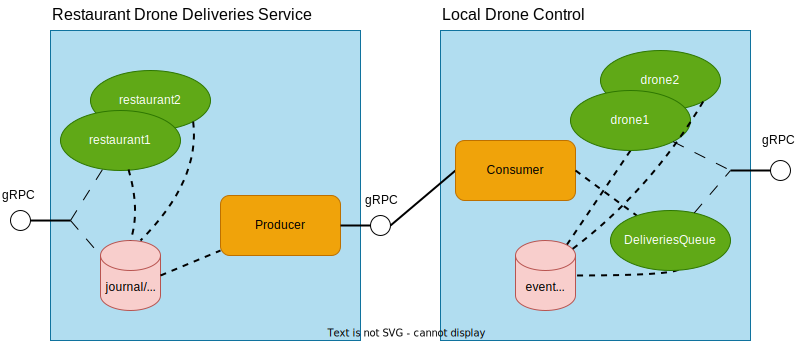

# Local Drone Delivery Selection

In the previous step of the guide we implemented the means for the cloud service to keep track of restaurant and the
queue of registered deliveries for each.



We want to replicate the registered events to each local-drone-control PoP so that the drones close to it can pick up
orders and perform the deliveries.

Again we will use @extref[Akka Projection gRPC](akka-projection:grpc.html) to do service-to-service events passing 
without requiring a message broker in between services. 

We will then implement a service allowing the drones to ask the local-drone-control to assign them the closest waiting
delivery.

## Replication of the delivery events

First we must set up replication of the events from the restaurant-drone-deliveries-service. 

The regular @extref[Akka Projection gRPC](akka-projection:grpc.html) behavior is that the consumer connects to the 
producer, in this case the local-drone-control being the consumer connecting to the cloud.

To implement this we define an `EventProducerSource` and create a gRPC request handler for it. We use a protobuf message
that we transform the internal domain event `DeliveryRegistered` using a `Transformation`. Any other message type
is filtered out and not replicated to the consumers using the `orElseMapper`:

Scala
:  @@snip [DeliveryEvents.scala](/samples/grpc/restaurant-drone-deliveries-service-scala/src/main/scala/central/deliveries/DeliveryEvents.scala) { }

Java
:  @@snip [DeliveryEvents.java](/samples/grpc/restaurant-drone-deliveries-service-java/src/main/java/central/deliveries/DeliveryEvents.java) { }


The gRPC request handler is composed with the other gRPC handlers of the service into a single bound server:

Scala
:  @@snip [DroneDeliveriesServer.scala](/samples/grpc/restaurant-drone-deliveries-service-scala/src/main/scala/central/DroneDeliveriesServer.scala) { #composeAndBind }

Java
:  @@snip [DroneDeliveriesServer.java](/samples/grpc/restaurant-drone-deliveries-service-java/src/main/java/central/DroneDeliveriesServer.java) { #composeAndBind }

Since we expect a high number of local-drone-control edge systems connecting to the restaurant-drone-deliveries-service
to consume the restaurant orders we configure the @extref[events-by-slice-firehose](akka:persistence-query.html#eventsbyslice-and-currenteventsbyslice)
for the projection. The firehose tries to share the stream of events across consumers connected to the same node, instead
of each consumer executing its queries in parallel, so that less load is applied to the database.

The firehose is enabled through the following configuration selecting it as query-plugin-id for the `akka.projection.grpcproducer`
and then configuring the actual underlying `akka.persistence.r2dbc.query` as query plugin for the firehose:

Scala
:  @@snip [persistence.conf](/samples/grpc/restaurant-drone-deliveries-service-scala/src/main/resources/persistence.conf) { #firehose }

Java
:  @@snip [persistence.conf](/samples/grpc/restaurant-drone-deliveries-service-java/src/main/resources/persistence.conf) { #firehose }

## Delivery queue actor 

The queue of all deliveries for one local-drone-control service is managed by a single durable state actor to keep things simple. 

For a high throughput of deliveries, a single actor might become a congestion point and a more clever scheme, for example partitioning
the deliveries into multiple queues based on the coarse grained coordinate of the restaurant, could make sense.

### Commands and events

The actor accepts the command `AddDelivery` to enqueue a delivery, the commands `RequestDelivery` and `CompleteDelivery`
for drones to pick up and complete deliveries and `GetCurrentState` for us to be able to inspect the current state of the queue:

Scala
:  @@snip [DeliveriesQueue.scala](/samples/grpc/local-drone-control-scala/src/main/scala/local/drones/DeliveriesQueue.scala) { #commands }

Java
:  @@snip [DeliveriesQueue.java](/samples/grpc/local-drone-control-java/src/main/java/local/drones/DeliveriesQueue.java) { #commands }

### State

In the state of the actor, we keep two lists, one is the waiting queue of deliveries, and one is the currently picked up
deliveries, waiting for the drone to report back once the delivery completed:

Scala
:  @@snip [DeliveriesQueue.scala](/samples/grpc/local-drone-control-scala/src/main/scala/local/drones/DeliveriesQueue.scala) { #state }

Java
:  @@snip [DeliveriesQueue.java](/samples/grpc/local-drone-control-java/src/main/java/local/drones/DeliveriesQueue.java) { #state }

### Command handler

The command handler de-duplicates orders by id for `AddDelivery` to avoid duplicates.

When a `RequestDelivery` comes in, we first check that there are deliveries waiting, and if there are we find the one
where the restaurant is closest to the current location of the drone. We then move the delivery from the `waitingDeliveries` queue 
to the `deliveriesInProgress` list, so that it is not selected again for another drone, and persist the state.

For the `CompleteDelivery` command, the delivery is removed from the state and then the updated state is persisted.

Scala
:  @@snip [DeliveriesQueue.scala](/samples/grpc/local-drone-control-scala/src/main/scala/local/drones/DeliveriesQueue.scala) { #commandHandler }

Java
:  @@snip [DeliveriesQueue.java](/samples/grpc/local-drone-control-java/src/main/java/local/drones/DeliveriesQueue.java) { #commandHandler }

## Consuming the delivery events

To consume the stream of delivery events from the central cloud we need to set up a projection. We only want to consume 
the events for the location id of the particular local-drone-control service, this is done through a consumer filter
first excluding all events and then selecting only the events for the configured location id:

Scala
:  @@snip [DeliveryEvents.scala](/samples/grpc/local-drone-control-scala/src/main/scala/local/drones/DeliveryEvents.scala) { }

Java
:  @@snip [DeliveryEvents.java](/samples/grpc/local-drone-control-java/src/main/java/local/drones/DeliveryEvents.java) { }

## gRPC services

### Drone deliveries

The method for drones to select the next delivery, and to complete it are added to the existing drone service:

Scala
:  @@snip [local.drones.drone_api.proto](/samples/grpc/local-drone-control-scala/src/main/protobuf/local/drones/drone_api.proto) { }

Java
:  @@snip [local.drones.drone_api.proto](/samples/grpc/local-drone-control-java/src/main/protobuf/local/drones/drone_api.proto) { }

Implementation of the generated service interface:

Scala
:  @@snip [DroneServiceImpl.scala](/samples/grpc/local-drone-control-scala/src/main/scala/local/drones/DroneServiceImpl.scala) { }

Java
:  @@snip [DroneServiceImpl.java](/samples/grpc/local-drone-control-java/src/main/java/local/drones/DroneServiceImpl.java) { }


### Inspecting the queue

We add a new gRPC service for inspecting the current state of the queue: 

Scala
:  @@snip [local.drones.deliveries_queue_api.proto](/samples/grpc/local-drone-control-scala/src/main/protobuf/local/drones/deliveries_queue_api.proto) { }

Java
:  @@snip [local.drones.deliveries_queue_api.proto](/samples/grpc/local-drone-control-java/src/main/protobuf/local/drones/deliveries_queue_api.proto) { }

Implementation of the generated service interface:

Scala
:  @@snip [DeliveriesQueueServiceImpl.scala](/samples/grpc/local-drone-control-scala/src/main/scala/local/drones/DeliveriesQueueServiceImpl.scala) { }

Java
:  @@snip [DeliveriesQueueServiceImpl.java](/samples/grpc/local-drone-control-java/src/main/java/local/drones/DeliveriesQueueServiceImpl.java) { }


Finally, we need to start the gRPC server with the two services:

Scala
:  @@snip [LocalDroneControlServer.scala](/samples/grpc/restaurant-drone-deliveries-service-scala/src/main/scala/central/DroneDeliveriesServer.scala) { #composeAndBind }

Java
:  @@snip [LocalDroneControlServer.java](/samples/grpc/restaurant-drone-deliveries-service-java/src/main/java/central/DroneDeliveriesServer.java) { #composeAndBind }

## Running the sample

The complete sample can be downloaded from GitHub, but note that it also includes the next steps of the guide:

* Scala [drone-scala.zip](../attachments/drone-scala.zip)
* Java [drone-java.zip](../attachments/drone-java.zip)
  
As this service consumes events from the service built in the previous step, start the local-drone-control service first:

@@@ div { .group-scala }

To start the local-drone-control-service:

```shell
sbt run
```

@@@

@@@ div { .group-java }

```shell
mvn compile exec:exec
```

@@@

Then start the drone-restaurant-deliveries-service.

As the service needs a PostgreSQL instance running, start that up in a docker container and create the database
schema if you did not do that in a previous step of the guide:

```shell
docker compose up --wait
docker exec -i postgres_db psql -U postgres -t < ddl-scripts/create_tables.sql
```

Then start the service:

@@@ div { .group-scala }

```shell
sbt -Dconfig.resource=local1.conf run
```

And optionally one or two more Akka cluster nodes, but note that the local drone controls
are statically configured to the gRPC port of the first and will only publish events to that node.

```shell
sbt -Dconfig.resource=local2.conf run
sbt -Dconfig.resource=local3.conf run
```

@@@

@@@ div { .group-java }

```shell
mvn compile exec:exec -DAPP_CONFIG=local1.conf
```

And optionally one or two more Akka cluster nodes, but note that the local drone controls
are statically configured to the gRPC port of the first and will only publish events to that node.

```shell
mvn compile exec:exec -DAPP_CONFIG=local2.conf
mvn compile exec:exec -DAPP_CONFIG=local3.conf
```

@@@

Create a restaurant with [grpcurl](https://github.com/fullstorydev/grpcurl):

```shell
grpcurl -d '{"restaurant_id":"restaurant1","coordinates":{"latitude": 59.330324, "longitude": 18.039568}, "local_control_location_id": "sweden/stockholm/kungsholmen" }' -plaintext localhost:8101 central.deliveries.RestaurantDeliveriesService.SetUpRestaurant
```

Set up another restaurant, closest to a different local drone control

```shell
grpcurl -d '{"restaurant_id":"restaurant2","coordinates":{"latitude": 59.342046, "longitude": 18.059095}, "local_control_location_id": "sweden/stockholm/norrmalm" }' -plaintext localhost:8101 central.deliveries.RestaurantDeliveriesService.SetUpRestaurant
```

Register a delivery for the first restaurant

```shell
grpcurl -d '{"restaurant_id":"restaurant1","delivery_id": "order1","coordinates":{"latitude": 59.330841, "longitude": 18.038885}}' -plaintext localhost:8101 central.deliveries.RestaurantDeliveriesService.RegisterDelivery
```

Register a delivery for the second restaurant

```shell
grpcurl -d '{"restaurant_id":"restaurant2","delivery_id": "order2","coordinates":{"latitude": 59.340128, "longitude": 18.056303}}' -plaintext localhost:8101 central.deliveries.RestaurantDeliveriesService.RegisterDelivery
```

Now update one or more drones a few times with [grpcurl](https://github.com/fullstorydev/grpcurl) against the local-drone-control:

```shell 
grpcurl -d '{"drone_id":"drone1", "coordinates": {"longitude": 18.07125, "latitude": 59.31834}, "altitude": 5}' -plaintext 127.0.0.1:8080 local.drones.DroneService.ReportLocation
 
grpcurl -d '{"drone_id":"drone1", "coordinates": {"longitude": 18.08125, "latitude": 59.41834}, "altitude": 10}' -plaintext 127.0.0.1:8080 local.drones.DroneService.ReportLocation

grpcurl -d '{"drone_id":"drone2", "coordinates": {"longitude": 18.08114, "latitude": 59.42122}, "altitude": 8 }' -plaintext 127.0.0.1:8080 local.drones.DroneService.ReportLocation
```

Request a delivery for drone1

```shell
grpcurl -d '{"drone_id":"drone1"}' -plaintext 127.0.0.1:8080 local.drones.DroneService.RequestNextDelivery
```

Mark the delivery as completed
```shell
grpcurl -d '{"delivery_id":"order1"}' -plaintext 127.0.0.1:8080 local.drones.DroneService.CompleteDelivery
```

Inspect the current state of the local delivery queue

```shell
grpcurl -plaintext 127.0.0.1:8080 local.drones.DeliveriesQueueService.GetCurrentQueue
```

## What's next?

* Packaging up the two services for deployment 