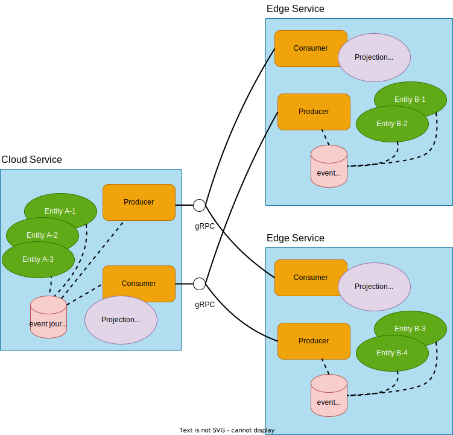
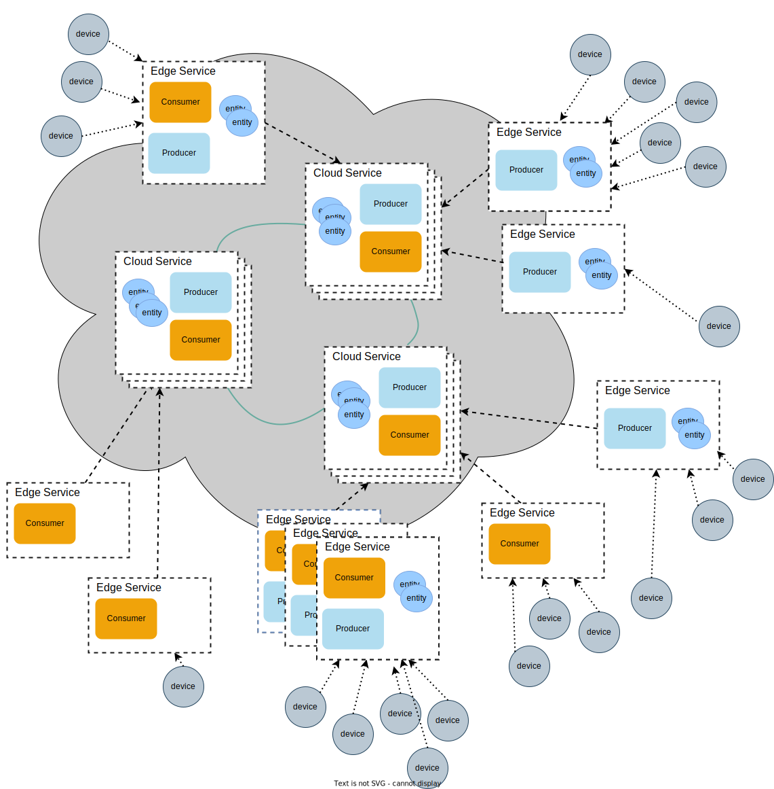

# Architectural Overview

Akka is great for building stateful distributed systems, that can also be stretched to geographically distributed locations
at the edge of the cloud.

Each geographical location can be a separate, fully autonomous, Akka Cluster or a standalone Akka node, and be connected
to the other Akka Clusters with the communication mechanisms provided by Akka Edge. These services are typically running
in the cloud and at the edge of the cloud. The services at the edge may run anywhere where you have resources to run
Akka in a JVM (or Java native image) and have network access from the edge to the more central services.

## Topology

The topology of cloud services, edge services and edge devices may look like this, but there are no technical
limitations other than network connectivity to use other topologies, such as one edge service interacting directly
with another edge service. In the end it is an application concern to define the topology and setup the connections
at startup or dynamically when the system is running.

The topology is typically that the edge services connect to services in a cloud region, like a star topology.

Each cloud service is typically an Akka Cluster. Several of these clusters may be deployed to different Kubernetes
clusters in different cloud regions for redundancy and geographical distribution. The cloud services may use
active-active entities or one-way event replication as provided by @extref[Akka Distributed Cluster](akka-distributed-cluster:).

The edge services connect to the cloud services and can use event replication in both directions to communicate with
cloud services. An edge service can be a single node or form a small Akka Cluster.

The edge service can be fully autonomous and continue working when there are network disruptions, or if the
edge service chooses to not always be connected. It will catch up on pending events when the communication is
established again.

Devices connect to the closest edge service with HTTP, MQTT, or any other suitable external protocol. 

## Communication transport

The communication transport between the Akka Edge application and other Akka Clusters is using reliable event replication over gRPC, which
gives characteristics such as:

* security with TLS and mutual authentication (mTLS)
* network friendly across different Kubernetes clusters, firewalls or NATs
* exactly-once processing or at-least-once processing
* asynchronous and brokerless communication without need of additional products

All gRPC connections are established from the edge service, independent of whether the edge service is producing or
consuming events.

## Event Replication

Event replication is at the core of Akka Edge. The event journal of the Event Sourced Entities
is the source of truth and also used as source for publishing events to other services. By streaming
the events from the journal directly to consumers with full backpressure based on demand from the consumer we
have a solution for asynchronous communication without requiring an intermediate message broker product.

The sequence numbers of the events and the offset tracking by the consumers via Akka Projections gives
at-least once reliable delivery with automatic de-duplication for exactly-once processing.

Entities are assigned to a "slice" for data partitioning. For parallel processing different consumers can take
different ranges of the slices. This consumer slice distribution can be scaled at runtime to be able to
adapt to changes in load.

Events are read from the journal when a consumer sets up a new subscription, but when the consumer is up-to-date
with the latest events it can consume the "live" events immediately without the latency from the database
round trip. This gives very low end-to-end latency. The journal is still used as the reliable source in
case the consumer can't keep up or in failure scenarios.

@@@ note
Currently, the event replication mechanism requires Event Sourced entities as the source on the producer side.
Replication of Akka's Durable State entities is currently not supported. 
@@@

## Dynamic filters

Events from all entities might not be needed at all locations. Therefore, it is possible to define filters that
select which entities to replicate where. These filters are typically defined by tagging the events with topics or
other custom tags, but filters can also select individual entity identifiers.

The filters can be defined on both the producer side and on the consumer side, and they can be changed at runtime.
The ability to dynamically change the filters without tearing down the event stream opens up for building
very flexible and efficient interactions between services or geographically distributed systems.

When a filter includes events from an entity that the consumer has not seen before, this is automatically detected
and the preceding events are replayed and delivered to the consumer so that it can process all events in the right
order.
