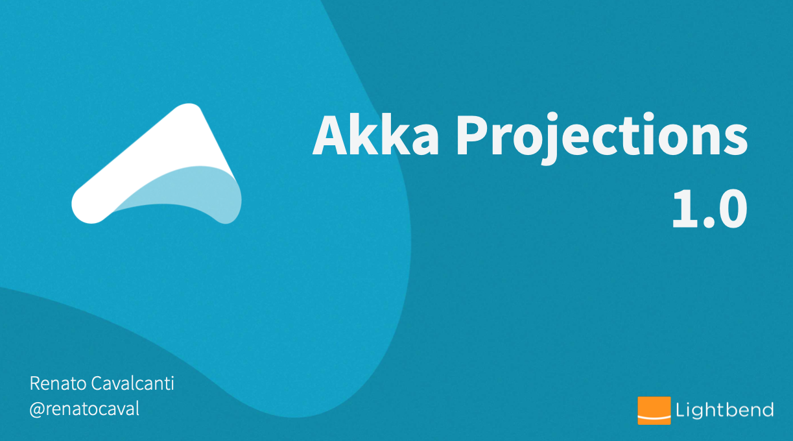

# Getting Started Guide

By now you should understand the fundamental concepts of how a Projection works by reading about its @ref:[use cases](../use-cases.md).
This guide will briefly describe the basic components of a Projection and instruct you step-by-step on how to build a functioning application.

The example used in this guide is based on a more complete application that is part of the @extref[Microservices with Akka tutorial](platform-guide:microservices-tutorial/). It builds a full @ref:[CQRS](../use-cases.md#command-query-responsibility-segregation-cqrs-) (Command Query Responsibility Segregation) ES (Event Sourcing) system using a combination of features from the Akka toolkit.

@@toc { depth=2 }

@@@ index

* [Setup your application](setup-your-app.md)
* [Choosing a Source Provider](source-provider.md)
* [Build a Stateful Projection handler](projection-handler.md)
* [Writing tests for a Projection](testing.md)
* [Running the Projection](running.md)
* [Running the Projection in Akka Cluster](running-cluster.md)

@@@

## Video Introduction

This video on YouTube gives a short introduction to Akka Projections for processing a stream of events or records from a source to a projected model or external system.

