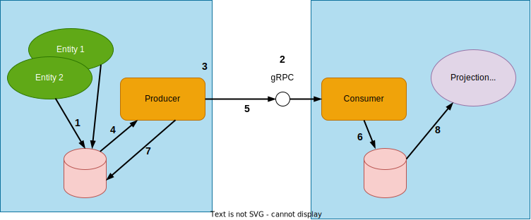

# Akka Projection gRPC with producer push

Normally for @ref[Akka Projection gRPC](grpc.md) the consumer connects to the producers and requests them to stream relevant journal
events back.

In some use cases it is not possible for the consumer to connect to the producers, for example because of firewalls or
NAT in front of each producer. The consumer may also not know about all producers up front. 
Akka Projection gRPC producer push solves this by letting the producers initiate the connection to the consumer and then
push events that the consumer is interested in.

@@@ warning

This module is currently marked as [May Change](https://doc.akka.io/docs/akka/current/common/may-change.html)
in the sense that the API might be changed based on feedback from initial usage.
However, the module is ready for usage in production and we will not break serialization format of
messages or stored data.

@@@

## Overview

1. Entities stores their events journal in the producer journal.
1. The consumer service accepts gRPC connections from producers.
1. The producer establishes a replication stream to the consumer.
1. Events are read from the journal.
1. Event is emitted to the replication stream.
1. The consumer writes incoming events directly to its configured journal.
1. The producer keeps track of offset for the stream.
1. On the consumer, separate projections can run over the local journal with events from all producers.

## Dependencies

Producer push is provided by the Akka Projection gRPC module, refer to @ref[the dependency info in the Akka Projection gRPC page](grpc.md#dependencies).

## Consumer set up

Setting up the consumer starts with creating an @apidoc[EventProducerPushDestination] defining what stream id it will accept.
The stream id is a public identifier of entity types between producers and consumers, a producer pushing events for unknown
stream ids will be denied.

The destination is then used as a parameter to @apidoc[EventProducerPushDestination]{grpcServiceHandler} to get a gRPC service 
handler that can be bound as an Akka HTTP/gRPC endpoint:

Scala
:  @@snip [ShoppingCartEventConsumer.scala](/akka-projection-grpc-tests/src/it/scala/akka/projection/grpc/producer/EventProducerPushSpec.scala) { #consumerSetup }

Java
:  @@snip [ShoppingCartEventConsumer.java](/akka-projection-grpc-tests/src/test/java/akka/projection/grpc/consumer/javadsl/EventProducerPushDestinationCompileTest.java) { #consumerSetup }

### Filtering

The consumer can define filters for what events it wants the producers to send. Filtered events will still have an entry
in the consumer journal but without any payload sent from the producer or stored in the consumer.

Filters are set for the destination using @apidoc[withConsumerFilters](EventProducerPushDestination){ scala="withConsumerFilters" java ="withConsumerFilters" }

Scala
:  @@snip [ShoppingCartEventConsumer.scala](/akka-projection-grpc-tests/src/it/scala/akka/projection/grpc/producer/EventProducerPushSpec.scala) { #consumerFilters }

Java
:  @@snip [ShoppingCartEventConsumer.java](/akka-projection-grpc-tests/src/test/java/akka/projection/grpc/consumer/javadsl/EventProducerPushDestinationCompileTest.java) { #consumerFilters }

For a full overview of the available types of filters see @ref[the filter section of the Akka Projection gRPC page](grpc.md#filters).

Note that producer push does not currently provide the capability to dynamically change the filters once a destination is started.
This may be implemented as a future improvement.

### Transformation

The events and some of their metadata can be transformed before being stored in the consumer, @apidoc[withTransformation](EventProducerPushDestination){ scala="withTransformation" java="withTransformation" }
defines a single transformation to use for all producers, while @apidoc[EventProducerPushDestination]{withTransformationForOrigin} 
is invoked with an origin id for the producer and additional metadata specified when setting up the producer and can provide
transformations based on those.

The payload transformation also allows for arbitrary filtering logic, returning a @scala[None]@java[Optional.empty()] marks
the event as filtered and avoids storing the payload in the consumer journal.

Scala
:  @@snip [ShoppingCartEventConsumer.scala](/akka-projection-grpc-tests/src/it/scala/akka/projection/grpc/producer/EventProducerPushSpec.scala) { #consumerTransformation }

Java
:  @@snip [ShoppingCartEventConsumer.java](/akka-projection-grpc-tests/src/test/java/akka/projection/grpc/consumer/javadsl/EventProducerPushDestinationCompileTest.java) { #consumerTransformation }

### Intercepting connections

Connections from producers can be intercepted by adding an interceptor via @apidoc[EventProducerPushDestination] `withInterceptor`.
This can be used together with the additional producer metadata to add authentication, as an alternative to or in addition to mTLS.

## Producer set up

The producer is essentially a special projection handler for a projection running on the producer. It could be a single actor system
running one projection handling all slices, or it could be @extref:[Sharded Daemon Process](akka:typed/cluster-sharded-daemon-process.md)
pushing events for partitioned slices of the entities.

The producer is created through @apidoc[EventProducerPush], which has a method `handler()` which returns a handler to be plugged into 
an `atLeastOnceFlow` projection. The first parameter, the `originId` is how the producer identifies itself to the consumer.

FIXME better producer setup sample than this

Scala
:  @@snip [ShoppingCartEventConsumer.scala](/akka-projection-grpc-tests/src/it/scala/akka/projection/grpc/producer/EventProducerPushSpec.scala) { #producerSetup }

Java
:  @@snip [ShoppingCartEventConsumer.java](/akka-projection-grpc-tests/src/test/java/akka/projection/grpc/producer/javadsl/EventProducerPushCompileTest.java) { #producerSetup }

### Filters

The producer can also define filters, an event filtered by the producer is never passed over to the consumer, regardless
of configured consumer filters. The filters are defined using `withProducerFilter` or `withTopicProducerFilter` on @apidoc[(akka.projection.grpc.producer.javadsl.EventProducerSource|akka.projection.grpc.producer.scaladsl.EventProducer.EventProducerSource)]. 

### Additional connection metadata

It is possible to define additional connection metadata that is passed to the consumer on connection when constructing the
@apidoc[EventProducerPush]. This can be used for authenticating a producer in the consumer interceptor, or providing 
additional details to use when transforming events in the consumer.

### Serialization

By default, the producer will use Akka Serialization to serialize each event for pushing to the consumer, this is convenient
but can tightly couple the producer and consumer so that they must be upgraded lock step, even though they are two separate
systems. To avoid problems and keeping the lifecycles of the producer and consumer systems separate it is better to use
an explicit protobuf message protocol for the events pushed.

This can be done in isolation for the producer push by transforming each type of outgoing messages with the `EventProducer.Transformation`
passed to the `EventProducerSource` on construction.

On the consuming side the protobuf messages can be turned from wire protocol protobuf messages back to some application domain
specific representation before storing in the journal with the `EventProducerPushDestination.Transformation` for the `EventProducerPushDestination`
on construction using `withTransformation` or `withTransformationForOrigin`.