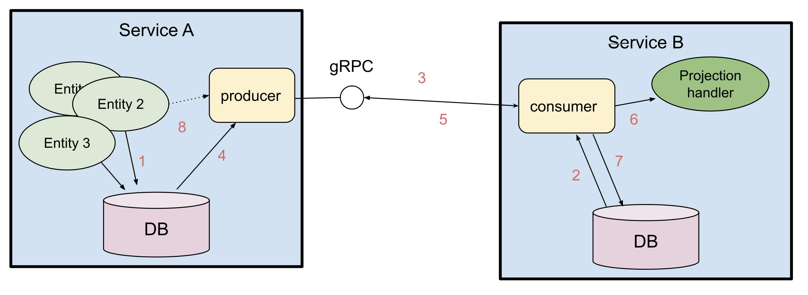

# Akka Projection gRPC

Akka Projection gRPC can be used for implementing asynchronous event based service-to-service communication.
It provides an implementation of an Akka Projection that uses
@extref:[Akka gRPC](akka-grpc:index.html) as underlying transport between event producer and consumer.

@@@ warning

This module is currently marked as [May Change](https://doc.akka.io/docs/akka/current/common/may-change.html)
in the sense that the API might be changed based on feedback from initial usage.
However, the module is ready for usage in production and we will not break serialization format of
messages or stored data.

@@@

## Overview



1. An Entity stores events in its journal in service A.
1. Consumer in service B starts an Akka Projection which locally reads its offset for service A's replication stream.
1. Service B establishes a replication stream from service A.
1. Events are read from the journal.
1. Event is emitted to the replication stream.
1. Event is handled.
1. Offset is stored.
1. Producer continues to read new events from the journal and emit to the stream. As an optimization, events can also be published directly from the entity to the producer.

## Dependencies

To use the gRPC module of Akka Projections add the following dependency in your project:

@@dependency [sbt,Maven,Gradle] {
  group=com.lightbend.akka
  artifact=akka-projection-grpc_$scala.binary.version$
  version=$project.version$
}

Akka Projections require Akka $akka.version$ or later, see @ref:[Akka version](overview.md#akka-version).

@@project-info{ projectId="akka-projection-grpc" }

It is currently only possible to use @extref:[akka-persistence-r2dbc](akka-persistence-r2dbc:projection.html) as the
projection storage and journal for this module.

@@dependency [sbt,Maven,Gradle] {
group=com.lightbend.akka
artifact=akka-persistence-r2dbc_$scala.binary.version$
version=$akka.r2dbc.version$
group2=com.lightbend.akka
artifact2=akka-projection-r2dbc_$scala.binary.version$
version2=$akka.r2dbc.version$
}

### Transitive dependencies

The table below shows `akka-projection-grpc`'s direct dependencies, and the second tab shows all libraries it depends on transitively.

@@dependencies{ projectId="akka-projection-grpc" }

## Consumer

On the consumer side the `Projection` is an ordinary @ref:[SourceProvider for eventsBySlices](eventsourced.md#sourceprovider-for-eventsbyslices)
that is using `eventsBySlices` from the @apidoc[GrpcReadJournal].

Scala
:  @@snip [ShoppingCartEventConsumer.scala](/samples/grpc/shopping-analytics-service-scala/src/main/scala/shopping/analytics/ShoppingCartEventConsumer.scala) { #initProjections }

Java
:  @@snip [ShoppingCartEventConsumer.java](/samples/grpc/shopping-analytics-service-java/src/main/java/shopping/analytics/ShoppingCartEventConsumer.java) { #initProjections }

The Protobuf descriptors are defined when the @apidoc[GrpcReadJournal] is created. The descriptors are used
when deserializing the received events. @scala[The `protobufDescriptors` is a list of the `javaDescriptor` for the used protobuf messages.
It is defined in the ScalaPB generated `Proto` companion object.]
Note that GrpcReadJournal should be created with the @apidoc[GrpcReadJournal$] @scala[`apply`]@java[`create`] factory method
and not from configuration via `GrpcReadJournalProvider` when using Protobuf serialization.

The gRPC connection to the producer is defined in the [consumer configuration](#consumer-configuration).

The @extref:[R2dbcProjection](akka-persistence-r2dbc:projection.html) has support for storing the offset in a relational database using R2DBC.

The above example is using the @extref:[ShardedDaemonProcess](akka:typed/cluster-sharded-daemon-process.html) to distribute the instances of the Projection across the cluster.
There are alternative ways of running the `ProjectionBehavior` as described in @ref:[Running a Projection](running.md)

How to implement the `EventHandler` and choose between different processing semantics is described in the @extref:[R2dbcProjection documentation](akka-persistence-r2dbc:projection.html).

### gRPC client lifecycle

When creating the @apidoc[GrpcReadJournal] a gRPC client is created for the target producer. The same `GrpcReadJournal` 
instance and its gRPC client should be shared for the same target producer. The code examples above will share the instance
between different Projection instances running in the same `ActorSystem`. The gRPC clients will automatically be 
closed when the `ActorSystem` is terminated.

If there is a need to close the gRPC client before `ActorSystem` termination the `close()` method of the @apidoc[GrpcReadJournal]
can be called. After closing the `GrpcReadJournal` instance cannot be used again.

## Producer

Akka Projections gRPC provides the gRPC service implementation that is used by the consumer side. It is created with the @apidoc[EventProducer$]:

Scala
:  @@snip [PublishEvents.scala](/samples/grpc/shopping-cart-service-scala/src/main/scala/shopping/cart/PublishEvents.scala) { #eventProducerService }

Java
:  @@snip [PublishEvents.java](/samples/grpc/shopping-cart-service-java/src/main/java/shopping/cart/PublishEvents.java) { #eventProducerService }

Events can be transformed by application specific code on the producer side. The purpose is to be able to have a
different public representation from the internal representation (stored in journal). The transformation functions
are registered when creating the `EventProducer` service. Here is an example of one of those transformation functions:

Scala
:  @@snip [PublishEvents.scala](/samples/grpc/shopping-cart-service-scala/src/main/scala/shopping/cart/PublishEvents.scala) { #transformItemAdded }

Java
:  @@snip [PublishEvents.java](/samples/grpc/shopping-cart-service-java/src/main/java/shopping/cart/PublishEvents.java) { #transformItemAdded }

To omit an event the transformation function can return @scala[`None`]@java[`Optional.empty()`].

That `EventProducer` service is started in an Akka gRPC server like this:

Scala
:  @@snip [ShoppingCartServer.scala](/samples/grpc/shopping-cart-service-scala/src/main/scala/shopping/cart/ShoppingCartServer.scala) { #startServer }

Java
:  @@snip [ShoppingCartServer.java](/samples/grpc/shopping-cart-service-java/src/main/java/shopping/cart/ShoppingCartServer.java) { #startServer }

The Akka HTTP server must be running with HTTP/2, this is done through config:

Scala
:  @@snip [ShoppingCartServer.scala](/samples/grpc/shopping-cart-service-scala/src/main/resources/grpc.conf) { #http2 }

Java
:  @@snip [ShoppingCartServer.java](/samples/grpc/shopping-cart-service-java/src/main/resources/grpc.conf) { #http2 }

This example includes an application specific `ShoppingCartService`, which is unrelated to Akka Projections gRPC,
but it illustrates how to combine the `EventProducer` service with other gRPC services.

## Sample projects

Source code and build files for complete sample projects can be found in `akka/akka-projection` GitHub repository. 

Scala:

* [Producer service: shopping-cart-service-java](https://github.com/akka/akka-projection/tree/main/samples/grpc/shopping-cart-service-java)
* [Consumer service: shopping-analytics-service-java](https://github.com/akka/akka-projection/tree/main/samples/grpc/shopping-analytics-service-java)

Java:

* [Producer service: shopping-cart-service-scala](https://github.com/akka/akka-projection/tree/main/samples/grpc/shopping-cart-service-scala)
* [Consumer service: shopping-analytics-service-scala](https://github.com/akka/akka-projection/tree/main/samples/grpc/shopping-analytics-service-scala)

## Access control

### From the consumer

The consumer can pass metadata, such as auth headers, in each request to the producer service by passing @apidoc[akka.grpc.*.Metadata] to the @apidoc[GrpcQuerySettings] when constructing the read journal.

### In the producer

Authentication and authorization for the producer can be done by implementing a @apidoc[EventProducerInterceptor] and pass
it to the `grpcServiceHandler` method during producer bootstrap. The interceptor is invoked with the stream id and 
gRPC request metadata for each incoming request and can return a suitable error through @apidoc[GrpcServiceException]

## Performance considerations

### Lower latency

See @extref:[Publish events for lower latency of eventsBySlices](akka-persistence-r2dbc:query.html#publish-events-for-lower-latency-of-eventsbyslices)
for low latency use cases.

### Scalability limitations

Each connected consumer will start a `eventsBySlices` query that will periodically poll and read events from the journal.
That means that the journal database will become a bottleneck, unless it can be scaled out, when number of consumers increase.
The producer service itself can easily be scaled out to more instances. 

For the case of many consumers of the same event stream a future improvement to reduce the
database load would be to share results of the queries across the different consumers, since most of them are
probably reading at the tail of the same event stream.

## Configuration

### Consumer configuration

The configuration for the `GrpcReadJournal` may look like this:

@@snip [grpc.conf](/samples/grpc/shopping-analytics-service-java/src/main/resources/grpc.conf) { }

The `client` section in the configuration defines where the producer is running. It is an @extref:[Akka gRPC configuration](akka-grpc:client/configuration.html#by-configuration) with several connection options.

### Reference configuration

The following can be overridden in your `application.conf` for the Projection specific settings:

@@snip [reference.conf](/akka-projection-grpc/src/main/resources/reference.conf) {}

### Connecting to more than one producer

If you have several Projections that are connecting to different producer services they can be configured as separate
@apidoc[GrpcReadJournal] configuration sections.

```
consumer1 = ${akka.projection.grpc.consumer}
consumer1 {
  client {
    host = "127.0.0.1"
    port = 8101
  }
}

consumer2 = ${akka.projection.grpc.consumer}
consumer2 {
  client {
    host = "127.0.0.1"
    port = 8202
  }
}
```

The `GrpcReadJournal` plugin id is then `consumer1` and `consumer2` instead of the default `akka.projection.grpc.consumer`.
