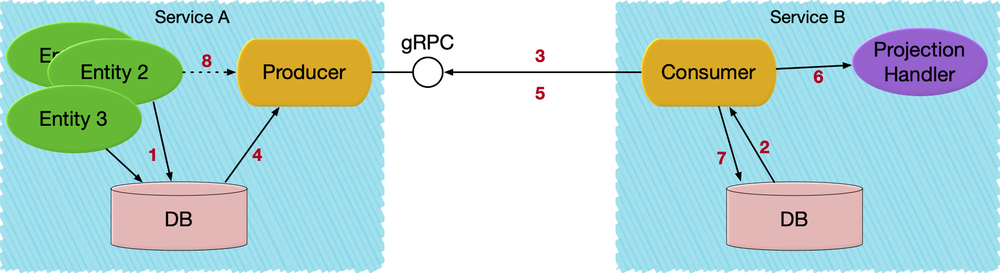

# Akka Projection gRPC

Akka Projection gRPC can be used for implementing asynchronous event based service-to-service communication.
It provides an implementation of an Akka Projection that uses
@extref:[Akka gRPC](akka-grpc:index.html) as underlying transport between event producer and consumer.

## Overview



1. An Entity stores events in its journal in service A.
1. Consumer in service B starts an Akka Projection which locally reads its offset for service A's replication stream.
1. Service B establishes a replication stream from service A.
1. Events are read from the journal.
1. Event is emitted to the replication stream.
1. Event is handled.
1. Offset is stored.
1. Producer continues to read new events from the journal and emit to the stream. As an optimization, events can also be published directly from the entity to the producer.

## Dependencies

To use the R2DBC module of Akka Projections add the following dependency in your project:

@@dependency [sbt,Maven,Gradle] {
  group=com.lightbend.akka
  artifact=akka-projection-grpc_$scala.binary.version$
  version=$project.version$
}

Akka Projections require Akka $akka.version$ or later, see @ref:[Akka version](overview.md#akka-version).

@@project-info{ projectId="akka-projection-grpc" }


### Transitive dependencies

The table below shows `akka-projection-grpc`'s direct dependencies, and the second tab shows all libraries it depends on transitively.

@@dependencies{ projectId="akka-projection-grpc" }

## Consumer

On the consumer side the `Projection` is an ordinary @ref:[SourceProvider for eventsBySlices](eventsourced.md#sourceprovider-for-eventsbyslices)
that is using `eventsBySlices` from the @apidoc[GrpcReadJournal].

Scala
:  @@snip [ShoppingCartEventConsumer.scala](/samples/grpc/shopping-analytics-service-scala/src/main/scala/shopping/analytics/ShoppingCartEventConsumer.scala) { #initProjections }

Java
:  @@snip [ShoppingCartEventConsumer.java](/samples/grpc/shopping-analytics-service-java/src/main/java/shopping/analytics/ShoppingCartEventConsumer.java) { #initProjections }

The gRPC connection to the producer is defined in the [consumer configuration](#consumer-configuration).

The @extref:[R2dbcProjection](akka-persistence-r2dbc:projection.html) has support for storing the offset in a relational database using R2DBC.

The above example is using the @extref:[ShardedDaemonProcess](akka:typed/cluster-sharded-daemon-process.html) to distribute the instances of the Projection across the cluster.
There are alternative ways of running the `ProjectionBehavior` as described in @ref:[Running a Projection](running.md)

How to implement the `EventHandler` and choose between different processing semantics is described in the @extref:[R2dbcProjection documentation](akka-persistence-r2dbc:projection.html).

## Producer

Akka Projections gRPC provides the gRPC service implementation that is used by the consumer side. It is created with the @apidoc[EventProducer$]:

Scala
:  @@snip [PublishEvents.scala](/samples/grpc/shopping-cart-service-scala/src/main/scala/shopping/cart/PublishEvents.scala) { #eventProducerService }

Java
:  @@snip [PublishEvents.java](/samples/grpc/shopping-cart-service-java/src/main/java/shopping/cart/PublishEvents.java) { #eventProducerService }

Events can be transformed by application specific code on the producer side. The purpose is to be able to have a
different public representation from the internal representation (stored in journal). The transformation functions
are registered when creating the `EventProducer` service. Here is an example of one of those transformation functions:

Scala
:  @@snip [PublishEvents.scala](/samples/grpc/shopping-cart-service-scala/src/main/scala/shopping/cart/PublishEvents.scala) { #transformItemAdded }

Java
:  @@snip [PublishEvents.java](/samples/grpc/shopping-cart-service-java/src/main/java/shopping/cart/PublishEvents.java) { #transformItemAdded }

To omit an event the transformation function can return @scala[`None`]@java[`Optional.empty()`].

That `EventProducer` service is started in an Akka gRPC server like this:

Scala
:  @@snip [ShoppingCartServer.scala](/samples/grpc/shopping-cart-service-scala/src/main/scala/shopping/cart/ShoppingCartServer.scala) { #startServer }

Java
:  @@snip [ShoppingCartServer.java](/samples/grpc/shopping-cart-service-java/src/main/java/shopping/cart/ShoppingCartServer.java) { #startServer }

This example includes an application specific `ShoppingCartService`, which is unrelated to Akka Projections gRPC,
but it illustrates how to combine the `EventProducer` service with other gRPC services.

## Control access to the producer

Authentication and authorization for the producer can be done by implementing a @apidoc[EventProducerInterceptor] and pass
it to the `grpcServiceHandler` method during producer bootstrap. The interceptor is invoked with the stream id and 
gRPC request metadata for each incoming request and can return a suitable error through @apidoc[GrpcServiceException]

## Performance considerations

### Lower latency

See @extref:[Publish events for lower latency of eventsBySlices](akka-persistence-r2dbc:query.html#publish-events-for-lower-latency-of-eventsbyslices)
for low latency use cases.

### Scalability limitations

TODO

## Configuration

### Consumer configuration

The configuration for the `GrpcReadJournal` may look like this:

@@snip [grpc.conf](/samples/grpc/shopping-analytics-service-java/src/main/resources/grpc.conf) { }

The `client` section in the configuration defines where the producer is running. It is an @extref:[Akka gRPC configuration](akka-grpc:configuration.html#by-configuration) with several connection options.

TODO: Describe `proto-class-mapping`, but we might have a more convenient solution for that https://github.com/lightbend/akka-projection-grpc/issues/13 

### Reference configuration

The following can be overridden in your `application.conf` for the Projection specific settings:

@@snip [reference.conf](/akka-projection-grpc/src/main/resources/reference.conf) {}

### Connecting to more than one producer

If you have several Projections that are connecting to different producer services they can be configured as separate
@apidoc[GrpcReadJournal] configuration sections.

```
consumer1 = ${akka.projection.grpc.consumer}
consumer1 {
  client {
    host = "127.0.0.1"
    port = 8101
  }
}

consumer2 = ${akka.projection.grpc.consumer}
consumer2 {
  client {
    host = "127.0.0.1"
    port = 8202
  }
}
```

The `GrpcReadJournal` plugin id is then `consumer1` and `consumer2` instead of the default `akka.projection.grpc.consumer`.
