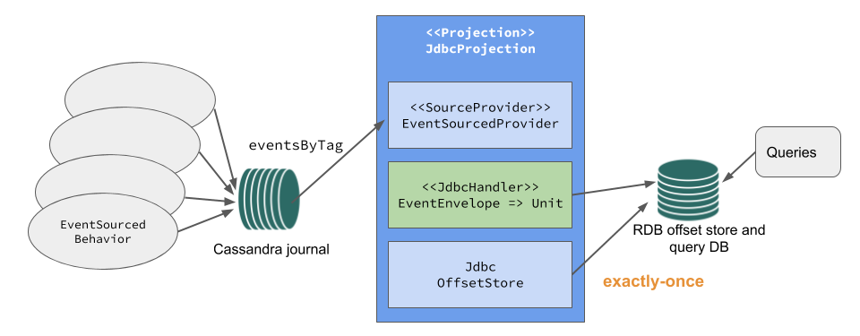
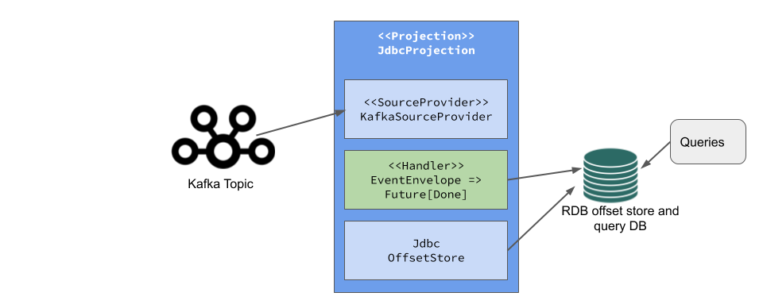

# Use Cases

Akka Projections is intended for the following primary use cases. It is not limited to these use cases,
because it is designed to be flexible in the way different sources and targets of the projections can be
composed.  

## Command Query Responsibility Segregation (CQRS)

CQRS is a pattern that is used for separating operations that write data from those that read the data.
Even though it's not necessary to use event sourcing for CQRS that is a common approach. Event sourced
entities can only be queried by their identifier and therefore it's often necessary to also have a
different model that can be queried. From the events you can maintain one or more representations that are
optimized for queries, for example in a relational database.

## Service to service communication

When designing your microservices, each service should own its data and have direct access to the database.
Other services should then use the Service API to interact with the data. There must be no sharing of databases
across different services since that would result in a too-tight coupling between the services. In this way,
each microservice operates within a clear boundary, similar to the [Bounded Context](https://martinfowler.com/bliki/BoundedContext.html)
strategic pattern in Domain-driven Design.

One service is publishing events:

Another service is consuming those events and builds its own representation:

